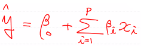

# 미분

## 미분의 종류

- 수치 미분 : 프로그램적으로 계산을 통해 미분 수행
- 해석 미분 : 이론에 입각하여 펜과 종이를 이용해서 미분을 수행

## 미분의 정의(미분함수, 도함수, derivative)

- 어떤 함수의 정의역 속 각 점에서 독립변수의 변화량과 함수값의 변화량의 비율의 극한으로 구성된 집합으로 치역이 구성되는 함수

## 미분법(differentiation) 

- 미분을 하는 작업, 도함수를 구하는 작업 그 자체

## 수치미분

- 전향차분
- 중앙차분 - 일반적으로 사용되는 방법(가장 정확도가 높다)
- 후향차분

- 프로그램으로 구현할때 x의 증가량은 10^-6정도로 정의

## 기본 미분 공식

- f(x) = constant -> f(x)' = 0
- f(x) = ax^n - > f(x)' = nax^n-1
- f(x) = e^x - > f(x)' = e^x
- f(x) = e^-x - > f(x)' = -e^-x
- f(x) = lnx - > f(x)' = 1/x

## 편미분(partial derivative)

- 입력변수(독립변수)가 두개 이상인 다변수 함수에서 미분하고자 하는 변수를 제외한 나머지 변수들을 상수처리해서 미분 진행

## 연쇄법칙(Chain Rule)

- 합성함수(composite function) : 여러 함수로 구성된 함수
- 합성함수를 미분 : Chain Rule > 함성함수를 구성하는 각 함수를 각각 미분해서 그 결과의 곱으로 계산

## Numerical Differentiation의 구현

- ipnb

## Regression (회귀)

- Regression Model은 어떠한 데이터에 대해서 
- 그 값에 영향을 주는 조건을 고려하여 (회귀계수)
- 데이터의 평균을 구하기 위한 함수
    - 평균이라는 표현: 일반적으로 대표성을 나타냄
- 그 데이터를 가장 잘 표현하는 함수

- ex) 독립변수가 1개인 함수를 가정하면 > y = b0 + b1x
  - b0 : 기타 영향을 주는 요인
  - b1 : x에 영향을 주는 요인

- 이 경우 데이터를 가장 잘 표현하는 직선을 찾는 것이라고 이야기 할 수 있음
  - Classical Linear Regression Model

- 프란시스 골턴 : 'Regression toword mean'

## Regression model

- 어떤 연속형 데이터 y와 이 y의 원인으로 생각되는 x간의 관계를 추정하기 위해서 만든 y = f(x) + e 관계식
- y = h(x1,x2,x3...xn,b1,b2...bn) + e
  - 조건에 따른 평균을 구하는 함수(회귀모델)
- 우리가 해결해야하는 현실이 너무 복합하여 단순화시키는 것 : 모델
  - 단순화를 위해 가정조건이 필요함

## Classical Linear Regression Model

- 오차항의 평균은 0이고 정규분포를 따른다
- 독립변수와 종속변수는 선형관계를 따른다
- 데이터에 이상치가 없어야 한다
- 독립변수와 오차항은 독립이다

- 단변량 선형 회귀모델

- 단순 선형 회귀모델(독립변수 1개)
- 다중 선형 회귀모델(독립변수 2개 이상)