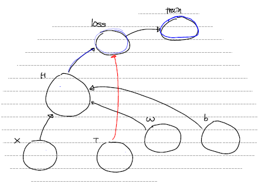

# Simple Linear Regression

## 1. Tensorflow

0.  사용한 library

    ```python
    import numpy as np
    import pandas as pd
    import tensorflow as tf
    ```


1.  traing data set

   - 2차원 배열형태로 만들기 위해 `reshpae()` 사용

   ```python
   x_data = np.array([1,2,3,4,5]).reshape(-1,1)
   t_data = np.array([3,5,7,9,11]).reshape(-1,1)
   ```

   

2.  placeholder

   - 1에서 만든 데이터를 받는 node 작성
   - 이때 shpae를 지정하여 2차원 형태로 변경
   - `None`은 어떤 형태가 들어와도 상관하지 않는다는 의미

   ```python
   X = tf.placeholder(shape=[None,1], dtype=tf.float32)
   T = tf.placeholder(shape=[None,1], dtype=tf.float32)
   ```

   

3.  Weight & bias 

   - 임의의 W, b를 지정
   - 입력값이 2차원이므로 직접적으로 계산되는 W 역시 형태를 맞춰 2차원으로 지정

   ```python
   W = tf.Variable(tf.random.normal([1, 1]), name='weight')
   b = tf.Variable(tf.random.normal([1]), name='bias')
   ```

   

4.  Hypothesis or predict model

   - 우리의 모델을 표현할 node 작성 (Y = W · X + b)

   ```python
   H = tf.matmul(X, W) + b
   ```

   

5.  Loss Function

   - 오차들의 제곱 합으로 이루어진 loss function을 표현할 node 작성
   - [reduce_mean()](https://www.tensorflow.org/versions/r1.15/api_docs/python/tf/math/reduce_mean) : 다차원 행렬의 평균을 구하는 함수. Defult는 모든 원소의 평균이며 axis를 지정하면 행 평균, 열 평균을 리턴한다.

   ```python
   loss = tf.reduce_mean(tf.square(H - T))
   ```

   

6. train

   - [GradientDescentOptimizer()](https://www.tensorflow.org/versions/r1.15/api_docs/python/tf/train/GradientDescentOptimizer) : 주어진 노드에 대해 경사하강법을 적용하는 함수. 이 함수를 통해 경사하강법을 진행하는 node를 작성할 수 있다.

   ```python
   train = tf.train.GradientDescentOptimizer(learning_rate=1e-3).minimize(loss)
   ```

   

7.  지금 까지 만든 data flow graph

    

    

8. session 만들기 & 초기화

   - 1.x 버전에선 초기화를 반드시 해야함

   ```python
   sess = tf.Session()
   sess.run(tf.global_variables_initializer()) # 2.x 넘어오면서 삭제
   ```

   

9. Learning

   - train node의 경우 계산을 진행하지만 실제 변화는 값은 W, b node이므로 train의 값은 필요없다. 그래서 _로 지정
   - [run()](https://www.tensorflow.org/versions/r1.15/api_docs/python/tf/Session#run) : `run()`안에 fetches를 list 형태로 데이터를 넘겨줌 ([train ,W, b, loss])

   ```python
   for step in range(30000):
       
       _,W_val,b_val,loss_val = sess.run([train,W,b,loss], feed_dict={X : x_data, T : t_data})
       
       if step % 3000 == 0:
           print('W : {}, b : {}, loss : {}'.format(W_val, b_val, loss_val))
   ```

   

10. Predict

   - 학습이 끝난뒤 W, b를 이용해서 새로운 X에 대한 Y를 예측

   ```python
   result = sess.run(H, feed_dict={X : [[9]]})
   print('예측값은 : {}'.format(result))
   ```

   

## 2.  Python

 0. 사용한 라이브러리

    ```python
    import numpy as np
    ```

    

1. training data set

   ```python
   x_data = np.array([1,2,3,4,5]).reshape(-1,1)
   t_data = np.array([3,5,7,9,11]).reshape(-1,1)
   ```

   

2. Weight & bias

   ```python
   W = np.random.rand(1,1)
   b = np.random.rand(1)
   ```

   

3. Hypothesis or predict model

   - 예측을 위한 모델 학습이 끝난뒤 새로운 값에 대한 예측을 위해 사용

   ```python
   def predict(x):
       
       y = np.dot(x,W) + b
       
       return y
   ```

   

4. loss function

   - loss function을 위한 함수 
   - 편미분 함수에서 사용해야 하기 때문에 형태를 맞춰 인자를 1개로 받는다

   ```python
   def loss_func(input_obj):
       # input_obj = [W, b]
       
       input_W = input_obj[0]
       input_b = input_obj[1]
       
       y = np.dot(x_data, input_W) + input_b
       
       return np.mean(np.power((t_data - y), 2))
   ```

   

5. 편미분 함수

   - 이전 시간에 작성한 편미분 함수
   - 편미분할 함수(f), 변수의 값(x)를 인자로 받는다

   ```python
   def numerical_derivative(f, x):
       
       delta_x = 1e-4
       derivative_x = np.zeros_like(x)
       
       it = np.nditer(x, flags=['multi_index'])
       
       while not it.finished:
           
           idx = it.multi_index 
           
           tmp = x[idx] 
           x[idx] = tmp + delta_x
           fx_plus_delta = f(x) 
           
           x[idx] = tmp - delta_x
           fx_minus_delta = f(x) 
           
           derivative_x[idx] = (fx_plus_delta - fx_minus_delta) / (2 * delta_x)
           
           x[idx] = tmp
           
           it.iternext()
           
       return derivative_x
   ```

   

6. learning rate and learning

   - `reval()`과 `concatenate()`을 이용해서 편미분 함수에 인자로 넣을 ndarray를 만든다
   - 미분한 결과에 learning rate을 곱한뒤 기존의 값과 `-`연산을 통해 경사하강법을 구현한다

   ```python
   learning_rate = 1e-4
   
   for step in range(300000):
       # reval() - 1차원으로 변경
       input_param = np.concatenate((W.ravel(), b.ravel()), axis=0) # [W b]
       derivative_result = learning_rate * numerical_derivative(loss_func, input_param)
       
       # 연산을 위해 slicing을 해서 ndarray 형태 유지
       W = W - derivative_result[:1].reshape(1,1)
       b = b - derivative_result[1:]
       
       if step % 30000 == 0:
           print('W : {}, b : {}'.format(W,b))
   ```

   

7. predict

   ```python
   print(predict(np.array([9]).reshape(-1,1)))
   ```

   

## 3. Sklearn

0. 사용한 library

   ```python
   import numpy as np
   from sklearn import linear_model
   ```

   

1. training data set

   ```python
   x_data = np.array([1,2,3,4,5]).reshape(-1,1)
   t_data = np.array([3,5,7,9,11]).reshape(-1,1)
   ```

   

2. linear regression model 생성

   - sklearn의 `LinearRegression()`를 이용하여 선형 회귀 모델 생성

   ```python
   model = linear_model.LinearRegression()
   ```

   

3. learning

   - `fit()`을 이용하여 모델에 적합시킬 값 입력

   ```python
   model.fit(x_data, t_data)
   ```

   

4. weight, bias 확인

   - 학습이 끝난 모델에서 `.coef_`, `.intercept_`로 W, b에 대해 접근

   ```python
   print('W : {}, b : {}'.format(model.coef_, model.intercept_))
   ```

   

5. predict

   `predict()`를 이용해 새로운 값을 이용한 예측

   ```pyhon
    print(model.predict([[9]]))
   ```

