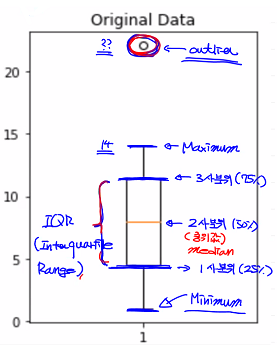

## GD의 한계

- grobal minimun과 local minimun이 다르면 grobal minimun을 찾지 못할 수 있다
- 초기의 W값에 따라 구하는 최솟값이 다를 수 있다
- 그래서 Loss Function이 볼록함수(convex function) 형태여야 최솟값을 원활히 구할 수 있다


## 데이터 전처리(Data preprocessing)

>  머신러닝에서 양질의 데이터가 있어야 학습을 잘 할 수 있다

- 이상치 처리 
- 정규화 : data feature의 scale의 차이가 나는 경우


### 1. 이상치

- 속성안에 들어있는 값이 일반적인 값에 비해 편차가 큰 값을 지칭
- 독립변수 측에 있는 이상치 > 지대점
- 종속변수 측에 있는 이상치 > `outlier`
  - 이러한 이상치는 찾아야 처리할 수 있다

- 이상치 검출 방식
  - Variance : 정규분포
  - Likelihood : 베이즈 정리를 이용(확률)
  - Nearnest-Neighbor : 모든 데이터쌍의 거리를 이용
  - Density : 카이제곱 분포 이용
  - ...
  - Tukey fence : 사분위 > boxplot을 이용해서 이상치를 graph에서 확인
  - Z - score : 정규분포와 표준편차


#### 1. Tukey fence

- Boxplot

  

- IQR : 3사분위값 - 1사분위값

- 이상치

  - 1사분위값 - (IQR*1.5) 미만으로 작은 값들
  - 3사분위값 + (IQR*1.5) 초과로 큰 값들

- Tukey fence 예시

  ```python
  dt = np.array([1,2,3,4,5,6,7,8,9,10,11,12,13,14,22.1])
  
  fig = plt.figure() # 새로운 figure를 생성
  fig_1 = fig.add_subplot(1,2,1)
  fig_2 = fig.add_subplot(1,2,2)
  
  fig_1.set_title('Original Data')
  fig_1.boxplot(dt)
  
  # numpy를 이용하여 사분위수 구하기
  print(np.median(dt)) # 중위값 = 2사분위값
  print(np.percentile(dt,25)) # 1사분위값
  print(np.percentile(dt,50)) # 2사분위값
  print(np.percentile(dt,75)) # 3사분위값
  
  # IQR 구하기
  iqr_value = np.percentile(dt,75) - np.percentile(dt,25)
  
  upper_fense = np.percentile(dt,75) + (iqr_value * 1.5)
  lower_fense = np.percentile(dt,25) - (iqr_value * 1.5)
  
  # 이상치 출력
  print(dt[(dt > upper_fense) | (dt < lower_fense)])
  
  # 이상치 제외
  result = dt[(dt <= upper_fense) & (dt >= lower_fense)]
  
  fig_2.set_title('Remove Outiler')
  fig_2.boxplot(result)
  
  fig.tight_layout()
  plt.show()
  ```

  

  ![img](data:image/png;base64,iVBORw0KGgoAAAANSUhEUgAAAagAAAEYCAYAAAAJeGK1AAAAOXRFWHRTb2Z0d2FyZQBNYXRwbG90bGliIHZlcnNpb24zLjMuMiwgaHR0cHM6Ly9tYXRwbG90bGliLm9yZy8vihELAAAACXBIWXMAAAsTAAALEwEAmpwYAAAWKUlEQVR4nO3dfbRddX3n8fengFWeJDFXRVBjLdJQ1qid1PGBUSgyRYvizFhLWh2cpmU6U6k6an3IUqAjLju12hmc0aYGYQRiK/iALbUixWGyitobRwoYp1hBiARyeVBQsYh854+zQw/X3OTm3Juzf/fe92utu845e++z9/ck53c+5/fb++ydqkKSpNb8RN8FSJK0MwaUJKlJBpQkqUkGlCSpSQaUJKlJBpQkqUkG1JgleVuSD833srNYVyX56flYl6S9I8kHk7y9u39skq1919QnA2oOkrw6ybVJvp/ktiQfSHLIrp5TVe+qqt+Yzfr3ZNm5SPL5JD9Icm+Se5JsTvKWJD+5B+swADWjJDcluS/Jd7u2cl6SA/uuay6SHJ7kwiR3Jvleki8lOWkPnv/qJJuGp1XVb1XVf5n/ahcmA2pESd4A/D7wJuDRwLOBJwOXJ3nEDM/Zd3wV7rHXVNVBwKHAG4BTgMuSpN+ytIi8pKoOBJ4BPBN4a7/ljC7JcmATcD/ws8AK4H3ARUle3mdt0PxnzawZUCNIcjBwFnB6VX2mqn5YVTcBr2AQUq/sljszycVJLkhyD/DqbtoFQ+v6d0m+2X0Le3v3TfOFQ8+/oLu/suulnJrk5iR3JFk3tJ5nJbk6ybeTbEvy/pmCcleq6ntV9XngpcBzgF/a3fqTXNU9/ZruG/KvJFmW5M+TTCW5u7t/+J7Wo8Wnqm4D/opBUAGQ5NlJ/qZ7f12T5NiheZ9P8s5u/neTfDrJY7reyz1J/jbJyqHln9tN+053+9xu+ilJJodrSfL6JJd2938yyXu69nV7N9z2qBlexuuB7wJrq+q2qrqvqjYCZwN/mIEdbfahsOhey28kWQV8EHhO95q+3c0/L8k7d7bBJE9IcknXpm5M8jtD837ss2bX/wsLgwE1mucCjwQ+Pjyxqr4L/CVwwtDkk4GLgUOAC4eXT3IU8D+BX2PQc3k0cNhutn0McCRwPPCO7o0O8CMGjWYFg2A5HvhPe/ayHvZabgYmgX+5u/VX1fO7ZZ5eVQdW1Z8yeG99mEFgPwm4D3j/qPVo8ei+qLwI+Hr3+DDgL4B3AsuBNwKXJJkYetopwKsYtI+nAlczeH8tB7YAZ3TrWt6t678DjwHeC/xFkscAlwJHJjliaL2/ClzU3f994GkMgvOnu229Y4aXcQJwSVU9OG36nzF4vz9tV/8GVbUF+C3g6q7NHLKr5ZP8BPBp4JquruOB1yX5xaHFZvysWagMqNGsAO6oqgd2Mm9bN3+Hq6vqk1X1YFXdN23ZlwOfrqpNVXU/g8awu5MjntV9W7uGwZv16QBVtbmqvlBVD3S9uT8GXrDnL+1hbmXwAbDH66+qO6vqkqr6flXdy+Cb5Vzr0cL2yST3ArcA2+lChcGIw2VVdVnXTi5n8OXoxUPP/XBV/UNVfYfBl8B/qKrPdW3wYwyGDGHQ47+hqj7SvVc3Al9jMLz4feBTwBqALqh+Bri0G8r+TeD1VXVX9559F4Ng3JkVDNr6dNuG5s+nnwcmqur3qur+qvoG8CfT6tvVZ82CZECN5g5gxQzjvId283e4ZRfrecLw/K4B3bmbbd82dP/7wIEASZ7WDaPd1nXx38XcG8lhwF2jrD/J/kn+uBu+vAe4CjgkyT5zrEkL18u6/ZzHMgiGHe+fJwO/3A3vfbsb7jqGQVva4fah+/ft5PGOAy6eAHxz2na/yT+NTFxEF1AMek+f7NrdBLA/sHmohs9003fmjmn17XDo0Pz59GTgCdP+jd4GPG5omV191ixIBtRorgb+Efg3wxOTHMBg6OKKocm76hFtAx7aL9ONdz9mxJo+wOCb4hFVdTCDN+/IBzgkeSLwz4H/M+L638BgKPJfdMvvGAb0oIslrqr+N3Ae8J5u0i3AR6rqkKG/A6rq3SOs/lYGH+bDngR8q7v/WQZfLp/BIKh2DO/dwSDofnaohkd3B3XszOeAf9sNvQ17Rfd6/h74Xjdt/6H5jx+6vyeXkrgFuHHav9FBVTXcy1x0l6YwoEbQDTOcBZyT5MQk+3U7aT8GbAU+MstVXQy8pNup+4hunaN+gB8E3AN8N8nPAP9xlJV0PZ8XMBgK+RJw2SzXfzvwU9PquQ/4drdf4Aykf/JHwAldUFzAoB38YpJ9kjwyg98AjXJQzWXA05L8apJ9k/wKcBTw5wDdkODFwB8wGL6+vJv+IIMhs/cleSwM9o1N28cz7H3AwcCGJI/val4DrAPeVANTDILxld3r+nUG+892uB04PLM7mOlLwD1J3pzkUd36jk7y83vwb7PgGFAjqqr/yqAX8R4GH9xfZPAt5/iq+sdZruN64HTgowx6U/cyGJuf1fOneSODIYt7GTS0P93D57+/2z9wO4MPj0uAE4d2Au9u/WcC53fDD6/o1vEoBt9Mv8BguEQCoPvw/l/A26vqFgY7+N8GTDFoR29ihM+nqroTOIlBD/5O4HeBk6pqeMjtIuCFwMem7Ud+M4MDN77QDUt/jsEowEzbOYbBwVJf7bb1n4FXdQcJ7fCb3Wu5k8Hh6H8zNO+vgeuB25Lsckiwqn4EvITBARw3MmhXH2JwYNWiFS9Y2I4Mfrj4bQbDaDf2XI4k9coeVM+SvKQbVjuAQW/sWuCmfquSpP4ZUP07mcGO3VuBI4BTym6tJDnEJ0lqkz0oSVKTxnpCwRUrVtTKlSvHuUlpr9m8efMdVTXTDzn3KtuSFpOZ2tJYA2rlypVMTk7ufkFpAUgy/YwFY2Nb0mIyU1tyiE+S1CQDSpLUJANKktQkA0qS1CQDSpLUJANKktQkA2oR2bhxI0cffTT77LMPRx99NBs3buy7JA1Jcm6S7Umu28m8NyapJPN9JVZpwTKgFomNGzeybt06zjnnHH7wgx9wzjnnsG7dOkOqLecBJ06f2F0c8gTg5nEXJLXMgFokzj77bDZs2MBxxx3Hfvvtx3HHHceGDRs4++yz+y5Nnaq6CrhrJ7Pex+C6RZ4YUxoy1jNJaO/ZsmULxxxzzMOmHXPMMWzZsqWnijQbSV4KfKuqrkl2fTHlJKcBpwE86UlPGkN1S8Pu/t1n4om29z57UIvEqlWr2LRp08Ombdq0iVWrVvVUkXYnyf4MLhH+jtksX1Xrq2p1Va2emOjlFICLUlXN+Ler+dr7DKhFYt26daxdu5Yrr7ySH/7wh1x55ZWsXbuWdevW9V2aZvZU4CnANUluAg4Hvpzk8b1WJTXCIb5FYs2aNQCcfvrpbNmyhVWrVnH22Wc/NF3tqaprgcfueNyF1OqquqO3oqSGGFCLyJo1awykhiXZCBwLrEiyFTijqjb0W5XULgNKGpOq2uW3h6paOaZSpAXBfVCSpCYZUJKkJhlQkqQmGVCSpCYZUJKkJhlQkqQmGVCSpCYZUJKkJhlQkqQmGVCSpCYZUJKkJhlQkqQm7TagkjwxyZVJtiS5Pslru+nLk1ye5IbudtneL1eStFTMpgf1APCGqloFPBv47SRHAW8BrqiqI4AruseSJM2L3QZUVW2rqi939+8FtgCHAScD53eLnQ+8bC/VKElagvZoH1SSlcAzgS8Cj6uqbTAIMYauDDrtOaclmUwyOTU1NcdyJUlLxawDKsmBwCXA66rqntk+r6rWV9Xqqlo9MTExSo2SpCVoVgGVZD8G4XRhVX28m3x7kkO7+YcC2/dOiZKkpWg2R/EF2ABsqar3Ds26FDi1u38q8Kn5L0+StFTtO4tlnge8Crg2yVe6aW8D3g38WZK1wM3AL++VCiVJS9JuA6qqNgGZYfbx81uOJEkDnklCktQkA0qS1CQDShqTJOcm2Z7kuqFpf5Dka0n+LsknkhzSY4lSUwwoaXzOA06cNu1y4Oiq+mfA3wNvHXdRUqsMKGlMquoq4K5p0z5bVQ90D78AHD72wqRGGVBSO34d+Mu+i5BaYUBJDUiyjsGVAy7cxTKe11JLigEl9SzJqcBJwK9VVc20nOe11FIzmzNJSNpLkpwIvBl4QVV9v+96pJbYg5LGJMlG4GrgyCRbu9OEvR84CLg8yVeSfLDXIqWG2IOSxqSq1uxk8oaxFyItEPagJElNMqAkSU0yoCRJTTKgJElNMqAkSU0yoCRJTTKgJElNMqAkSU0yoCRJTTKgJElNMqAkSU0yoCRJTTKgJElNMqAkSU0yoCRJTTKgJC16y5cvJ8ke/wF7/Jzly5f3/GoXDy9YKGnRu/vuu6mqsWxrR7Bp7uxBSZKaZEBJkppkQEmSmmRASZKaZEBJkppkQEmSmmRASZKaZEBJY5Lk3CTbk1w3NG15ksuT3NDdLuuzRqklBpQ0PucBJ06b9hbgiqo6AriieywJA0oam6q6Crhr2uSTgfO7++cDLxtnTVLLDCipX4+rqm0A3e1jZ1owyWlJJpNMTk1Nja1AqS8GlLRAVNX6qlpdVasnJib6Lkfa6wwoqV+3JzkUoLvd3nM9UjN2G1AzHHl0ZpJvJflK9/fivVumtGhdCpza3T8V+FSPtUhNmU0P6jx+/MgjgPdV1TO6v8vmtyxp8UmyEbgaODLJ1iRrgXcDJyS5ATiheyyJWVwPqqquSrJyDLVIi1pVrZlh1vFjLURaIOayD+o1Sf6uGwKc8ceFHnkkSRrFqAH1AeCpwDOAbcAfzrSgRx5JkkYxUkBV1e1V9aOqehD4E+BZ81uWJGmpGymgdhwW2/nXwHUzLStJ0ih2e5BEd+TRscCKJFuBM4BjkzwDKOAm4D/svRIlSUvRbI7i29mRRxv2Qi2SJD3EM0lIkppkQEmSmmRASZKaZEBJkpq024Mk1KYkIz+3quaxEknaOwyoBWpXIZPEEJK04DnEJ0lqkgElSWqSASVJapIBJUlqkgElSWqSASVJapIBJUlqkgElSWqSASVJapIBJUlqkgElSWqSASVJapIBJTUgyeuTXJ/kuiQbkzyy75qkvhlQUs+SHAb8DrC6qo4G9gFO6bcqqX8GlNSGfYFHJdkX2B+4ted6pN4ZUFLPqupbwHuAm4FtwHeq6rPTl0tyWpLJJJNTU1PjLlMaOwNK6lmSZcDJwFOAJwAHJHnl9OWqan1Vra6q1RMTE+MuUxo7A0rq3wuBG6tqqqp+CHwceG7PNUm9M6Ck/t0MPDvJ/kkCHA9s6bkmqXcGlNSzqvoicDHwZeBaBu1yfa9FSQ3Yt+8CJEFVnQGc0XcdUkvsQUmSmmRASZKa5BCfpEWvzjgYznz0+LaleWFANWz58uXcfffdIz13cDDY7C1btoy77rprpG1JrctZ91BV49lWQp05lk0tegZUw+6+++6xNipJaon7oCRJTTKgJElNMqAkSU0yoCRJTTKgJElNMqAkSU0yoCRJTTKgJElNMqAkSU3abUAlOTfJ9iTXDU1bnuTyJDd0t8v2bpmSpKVmNj2o84ATp017C3BFVR0BXNE9liRp3uw2oKrqKmD6WURPBs7v7p8PvGx+y5IkLXWj7oN6XFVtA+huHzt/JUmSNIaDJJKclmQyyeTU1NTe3pwkaZEYNaBuT3IoQHe7faYFq2p9Va2uqtUTExMjbk6StNSMGlCXAqd2908FPjU/5UiSNDCbw8w3AlcDRybZmmQt8G7ghCQ3ACd0jyVJmje7vaJuVa2ZYdbx81yLJEkP8UwSUgOSHJLk4iRfS7IlyXP6rknq2257UJLG4r8Bn6mqlyd5BLB/3wVJfTOgpJ4lORh4PvBqgKq6H7i/z5qkFjjEJ/Xvp4Ap4MNJ/m+SDyU5oO+ipL4ZUFL/9gV+DvhAVT0T+B47Ob+lP3rXUmNASf3bCmytqi92jy9mEFgP44/etdQYUFLPquo24JYkR3aTjge+2mNJUhM8SEJqw+nAhd0RfN8A/n3P9Ui9M6CkBlTVV4DVfdchtcQhPklSkwwoSVKTDChJUpMMKElSkwwoSVKTDChJUpM8zLxhdcbBcOajx7ctSWqIAdWwnHUPVTWebSXUmWPZlCTNikN8kqQmGVCSpCYZUJKkJhlQkqQmGVCSpCYZUJKkJhlQkqQmGVCSpCYZUJKkJhlQkqQmGVCSpCYZUJKkJhlQkqQmGVCSpCYZUJKkJnk9KElLQpKxbGfZsmVj2c5SYEBJjUiyDzAJfKuqTuq7nsVk1At/JhnbRUP14xzik9rxWmBL30VIrTCgpAYkORz4JeBDfdcitcKAktrwR8DvAg/OtECS05JMJpmcmpoaW2FSXwwoqWdJTgK2V9XmXS1XVeuranVVrZ6YmBhTdVJ/DCipf88DXprkJuCjwC8kuaDfkqT+GVBSz6rqrVV1eFWtBE4B/rqqXtlzWVLvDChJUpP8HZTUkKr6PPD5nsuQmjCngOrGzO8FfgQ8UFWr56MoSZLmowd1XFXdMQ/rkSTpIe6DkiQ1aa4BVcBnk2xOctrOFvDHhZKkUcw1oJ5XVT8HvAj47STPn76APy6UJI1iTgFVVbd2t9uBTwDPmo+iJEkaOaCSHJDkoB33gX8FXDdfhUmSlra5HMX3OOAT3UXA9gUuqqrPzEtVkqQlb+SAqqpvAE+fx1q0E14FVNJS5ZkkGuZVQCUtZf4OSpLUJANKktQkA0qS1CQDSpLUJANKktQkA0qS1CQDSpLUJANKktQkA0qS1CQDSpLUJANKktQkA0qS1CQDSpLUJANKktQkA0rqWZInJrkyyZYk1yd5bd81SS3welBS/x4A3lBVX05yELA5yeVV9dW+C5P6ZA9K6llVbauqL3f37wW2AIf1W5XUPwNKakiSlcAzgS/uZN5pSSaTTE5NTY29NmncDCipEUkOBC4BXldV90yfX1Xrq2p1Va2emJgYf4HSmBlQUgOS7McgnC6sqo/3XY/UAgNK6lmSABuALVX13r7rkVphQEn9ex7wKuAXknyl+3tx30VJffMwc6lnVbUJSN91SK2xByVJapIBJUlqkgElSWqSASVJapIBJUlqkgElSWqSASVJapIBJUlqkgElSWqSASVJapKnOlqgBucXHW1+Vc13OdKCNWpbsh3tfQbUAmXjkOaHbaldDvFJkppkQEmSmmRASZKaZEBJkppkQEmSmjSngEpyYpL/l+TrSd4yX0VJkjRyQCXZB/gfwIuAo4A1SY6ar8IkSUvbXHpQzwK+XlXfqKr7gY8CJ89PWZKkpW4uAXUYcMvQ463dtIdJclqSySSTU1NTc9icJGkpmcuZJHZ2/o8f+0l2Va0H1gMkmUryzTlsU7OzArij7yKWgCf3teHNmzffYVsaC9vSeOy0Lc0loLYCTxx6fDhw666eUFUTc9ieZinJZFWt7rsO7T22pfGwLfVrLkN8fwsckeQpSR4BnAJcOj9lSZKWupF7UFX1QJLXAH8F7AOcW1XXz1tlkqQlbU5nM6+qy4DL5qkWzZ/1fRcgLRK2pR7FU81LklrkqY4kSU0yoCRJTTKgFpEk5ybZnuS6vmuRFjLbUhsMqMXlPODEvouQFoHzsC31zoBaRKrqKuCuvuuQFjrbUhsMKElSkwwoSVKTDChJUpMMKElSkwyoRSTJRuBq4MgkW5Os7bsmaSGyLbXBUx1JkppkD0qS1CQDSpLUJANKktQkA0qS1CQDSpLUJANKktQkA0qS1KT/D89IftDE/yi/AAAAAElFTkSuQmCC)


#### 2. Z-score

- 표준정규분포값을 이용하여 이상치 처리

- 기준이 되는 값을 설정한뒤 그 값을 넘는 관측치를 이상치라고 생각한다

-  Z-score 예시

    ```python
    from scipy import stats

    zscore_threshold = 1.8 # 2.0이 optimal value

    dt = np.array([1,2,3,4,5,6,7,8,9,10,11,12,13,14,22.1])

    # Outlier 출력
    outlier = dt[np.abs(stats.zscore(dt)) > zscore_threshold]
    print(dt[np.abs(((dt - dt.mean()) / dt.std()) > zscore_threshold)])

    # Outlier 제거
    dt[np.isin(dt, outlier, invert=True)]
    ```


