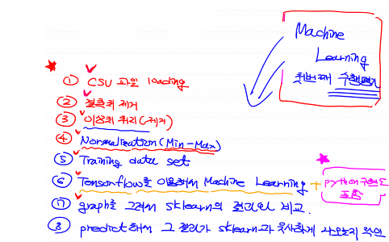

# 데이터 정규화

- 비율을 이용해서 data의 scale을 조정 ex) 0~1

- min- max Normalization
  - 데이터 정규화의 가장 일반적인 방법
  - 모든 feature의 값을 최솟값 0, 최댓값 1로 변환
  - Xscaled = X - Xmin / Xmax - Xmin
  - 이상치에 상당히 민감하다
  - 이상치 처리를 반드시 하고 사용해야 한다

- z-score Normalization (standardiztion : 표준화)
  - Xscaled =X - Xmean / Xstd
  - 장점 : 이상치에 크게 영향을 받지 않는다
  - 단점 : 동일한 scale을 적용할 수 없다
- 정규화를 진행하면 나중에 예측을 진행할때도 정규화한 값을 이용해야 한다

# 다중 선형 회귀로 확장

- 독립변수가 3개면

- H = b0 + b1x1+b2x3+b3x3

- H = x11 x12 x13     w1

  ​       x21 x22 x23  ·  w2  +  b

  ​       x31 x32 x33     w3