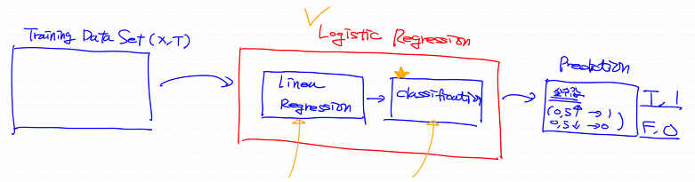
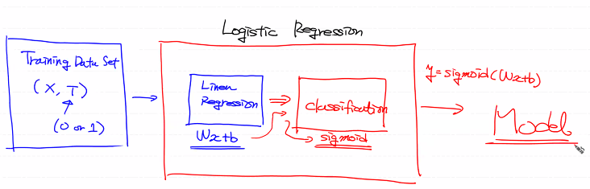
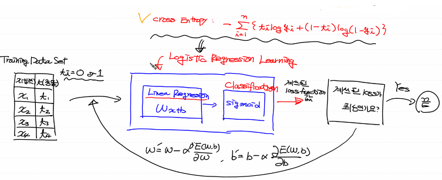

# Classification

- Training Data Set의 특징과 분포를 이용하여 학습한 후 미지의 데이터에 대해 결과가 어떤 종류의 값으로 분류될 수 있는지 예측하는 작업
  - Email Spam 판별
  - 주식의 주가가 오를지 떨어질지
  - MRI 사진으로 악성 종양 판단
  - 신용카드 사용지 도난카드 여부


# Logistic Regression

- Classification 알고리즘 중에 정확도가 상당히 높은 알고리즘
- Deep Learning의 기본 component로 사용



- Linear Regression으로는 Classification을 할 수 없는가?
  - Linear Regression에선 직선으로 주어진 데이터를 표현하기 때문에 필연적으로 직선은 우리가 예측하고자하는 값(0~1)을 넘어가는 범위까지 예측한다(Y값의 제한이 없다)
  - 따라서 Training Data Set에 따라 정확하지 않은 model을 도출하고 예측이 제대로 되지 않는다
- Logistic Regression에선 직선이 아닌 Sigmoid함수를 사용 (y의 값이 0~1)



- Linear Regression의 출력(model)인 Wx + b가 어떤 값을 가지더라도 출력함수로 sigmoid함수를 이용하면 0 ~ 1의 값으로 변환된다
  - 그 값이 0.5 이상이면 1을 출력
  - 0.5 미만이면 0을 출력

- Logistic Regression Model = 1 / (1 + e^-(Wx + b))
- 최적의 W와 b를 구하기 위해 loss 함수를 정의 (최소제곱법을 이용)하고 이 함수를 반복적으로 미분하여 W와 b를 갱신
- Logistic Regression Model을 이용하여 이전과 같은 방식으로 Loss 함수를 만들었을때 그 함수는 Convex 형태가 아니다

- Logistic Regression의 Loss 함수를 재정의 - Cross Entropy(Log Loss)




## 1. Python을 이용한 Linear Regression

```python
import numpy as np

def numerical_derivative(f, x):
    
    delta_x = 1e-4
    derivative_x = np.zeros_like(x)
    
    it = np.nditer(x, flags=['multi_index'])
    
    while not it.finished:
        
        idx = it.multi_index 
        
        tmp = x[idx] 
        x[idx] = tmp + delta_x
        fx_plus_delta = f(x) 
        
        x[idx] = tmp - delta_x
        fx_minus_delta = f(x) 
        
        derivative_x[idx] = (fx_plus_delta - fx_minus_delta) / (2 * delta_x)
        
        x[idx] = tmp
        
        it.iternext()
        
    return derivative_x

# Training Data Set
x_data = np.arange(2,21,2).reshape(-1,1) # 공부시간(독립변수)
t_data = np.array([0,0,0,0,0,0,1,1,1,1]).reshape(-1,1) # 합격여부

# Weight & bias
W = np.random.rand(1,1) # 행렬곱 연산을 위해 matrix 형태로 생성
b = np.random.rand(1)

# loss function
def loss_func(input_obj):
    
    input_W = input_obj[0].reshape(-1,1)
    input_b = input_obj[1]
    
    # linear regression의 hpyothesis : Wx + b
    z = np.dot(x_data, input_W) + input_b
    # logistic regression의 hpyothesis
    y = 1 / (1 + np.exp(-1 * z))
    
    delta = 1e-7 # 로그연산시 무한대로 발산하는것을 방지하기 위한 수치처리방식
    # cross entropy
    return -np.sum(t_data*np.log(y+delta) + (1-t_data)*np.log(1-y+delta))

# learning rate
learning_rate = 1e-4

# 학습 (GD 수행)
for step in range(300000):
    input_param = np.concatenate((W.ravel(), b.ravel()), axis=0)
    derivative_result = learning_rate * numerical_derivative(loss_func, input_param)
    
    W = W - derivative_result[0].reshape(-1,1)
    b = b - derivative_result[1]
    
    if step % 30000 == 0:
        input_param = np.concatenate((W.ravel(), b.ravel()), axis=0)
        print('W : {}, b : {}, loss : {}'.format(W.ravel(), b.ravel(), loss_func(input_param )))

# predict
def logistic_predict(x):
    
    z = np.dot(x, W) + b
    y = 1 / (1 + np.exp(-1 * z))
    
    if y < 0.5:
        result = 0
    else:
        result = 1
        
    return result, y

study_hour = np.array([[13]])
print(logistic_predict(study_hour))
```


## 2. Sklearn을 이용한 Linear Regression

```python
import numpy as np
from sklearn import linear_model

model = linear_model.LogisticRegression()
# 두번째 인자는 1차원이어야함
model.fit(x_data, t_data.ravel())

study_hour = np.array([[13]])
print(model.predict(study_hour))
result_pro = model.predict_proba(study_hour)
print(result_pro)
```


## 3. Tensorflow를 이용한 Linear Regression

```python
import numpy as np
import tensorflow as tf

# training data set
x_data = np.arange(2,21,2).reshape(-1,1)
t_data = np.array([0,0,0,0,0,0,1,1,1,1]).reshape(-1,1)

# placeholder
X = tf.placeholder(shape=[None,1], dtype=tf.float32)
T = tf.placeholder(shape=[None,1], dtype=tf.float32)

# W & b
W = tf.Variable(tf.random.normal([1,1]), name='weight')
b = tf.Variable(tf.random.normal([1]), name='bias')

# Hypothesis
logit = tf.matmul(X, W) + b
H = tf.sigmoid(logit)

# Loss function
loss = tf.reduce_mean(tf.nn.sigmoid_cross_entropy_with_logits(logits=logit, labels=T))

# train
train = tf.train.GradientDescentOptimizer(learning_rate=1e-4).minimize(loss)

# session
sess = tf.Session()
sess.run(tf.global_variables_initializer())

# learning
for step in range(300000):
    _,W_val,b_val,loss_val = sess.run([train,W,b,loss], feed_dict={X : x_data, T : t_data})
    
    if step % 30000 == 0:
        print('W : {}, b : {}, loss : {}'.format(W_val,b_val,loss_val))
        
study_hour = np.array([[12]])
result = sess.run(H, feed_dict={X : study_hour})
print(result)
```


