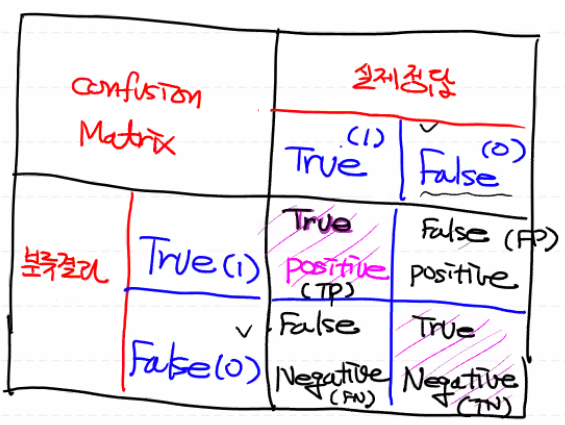

# 분류성능 평가지표

- 지금까지 작성한 logistic regression model이 잘 만들어진 모델인지 확인하기 위한 기준

# Confustion Matrix

## 1. Precision(정밀도)

   - 모델이 True라고 예측한 것중 실제 True인 것의 비율
   - TP / TP + FP
   - Positive 정답률, PPV(Positive Predictive Value)라고도 한다

## 2. Recall(재현율)
   - 실제 True인 것중에 모델이 True라고 예측한 것의 비율
   - TP / TP + FN
   - 민감도, Sensitiviy, Hit rate라고도 한다

### Precision vs Recall

- 입력된 사진에 고양이가 있는지를 검출하는 소프트웨어
  - 이 기술의 고양이 검출율은 99.9%
  - 이 기술의 고양이 검출율은 63.7%
    - '이 기술은 "오검출"을 하지 않는다'라고 생각을 전제로 한다
  - A 기술 99.9%의 검출율 + 그림 1장당 평균 5건의 오검출
  - B 기술 63.7%의 검출율 + 오검출이 거의 없다
- Recall : 고양이를 빠뜨리지 않고 얼마나 잘 검출하는지 나타내는 지표
- Precision : 검출한 결과가 얼마나 정확한지 나타내는 지표
- 일반적으로 Recall과 Precision은 상충관계
- Precision - Recall Graph

## 3. Accuracy(정확도)

- 앞의 두 지표는 True를 True로 옳게 예측한 경우에 대해서만 고려함
- 전체에서 실제 True를 True라고 예측하거나 실제 False를 False라고 예측한 비율

- TP + TN / TP + FN + FP + TN
- Domain의 bias를 반드시 고려해야 한다