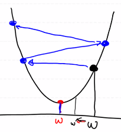

# Confustion Matrix 이어서

## 3. Accuarcy(정확도)

- TP + TN / TP + FN + FP + TN
- Domain의 bias를 반드시 고려해야 한다
  - 희귀병을 검출하는 경우 희귀병 자체의 확률이 적어 모델이 희귀병이 아니라고 예측할 확률이 높아진다

## 4. F1 score

- Precision과 Recall의 조화평균

- 2 * Precision* Recall / Precision + Recall

## 5. Fall-out

- FP / TN + FP

- 실제 False인데 Model이 True로 잘목 예측한 것의 비율

## 6. ROC curve

- Recall & Fall-out를 그래프로 표현

# Learning rate

- Learning rate : W와 b를 갱신할 때 사용되는 customizing 상수
- Learning rate를 필요이상으로 크게 설정하면 > Overshooting 현상 발생

- Learning rate를 필요이상으로 작게 설정하면 > local minimal 현상 발생

- 최적의 Learning rate를 찾는 이상적인 방법은 없다

# Overfitting(과대적합) & Underfitting(과소적합)

- Data를 이용해서 학습이 끝난 후 우리의 모델의 상태를 지칭하는 용어
- Overfitting (과대적합)
  - Model이 Training Data Set에 딱 들어맞는 형태로 만들어진 경우
  - 새로운 데이터를 제대로 예측하지 못한다

- Underfitting(과소적합)
  - 학습이 충분히 진행되지 않은 경우
  - Model이 미완성인 상태이므로 반복을 더 해야 한다

- Overfitting (과대적합)에 영향을 주는 요인

  - Epoch수
  - Data의 양(많은 Data가 필요)
    - 가진 Data가 별로 없는 경우 어떻게 해결해야 하는가?

  - Feature의 개수
    - 개수가 많을수록 Overfitting이 잘 일어난다
    - 중복되는 Feature를 제거하는 것이 좋다
    - 종속변수에 영향을 미치지 않는 Feature를 제거하는 것이 좋다

# Evaluation(성능평가)

- Training Data Set으로 성능평가를 진행하면 안된다

- Training Data Set : 학습에 이용되는 Data Set
- Validation Data Set : 학습도중 평가하여 Model을 수정하기 위해 이용되는 Data Set
- Test Data Set : 학습이 끝난 Model을 평가하기 위해 사용되는 Data Set
- 전체 Data의 양이 많아야 이러한 작업을 할 수 있다

- Epoch 당 Model이 갱신
  - Training Data Set으로 평가
    - Training Data Set으로 학습하기 때문에 Loss가 한없이 작아질 수 있다 > Overfitting
  - Validation Data Set으로 평가
    - Loss가 줄어드는데 한계가 있다 >  그 지점이 최적의 Epoch수 일 것

# 예제

- Data 전처리와 Logistic Regression의 기본 예제(Titanic 예제)
- Data는 Kaggle에서 받아서 사용