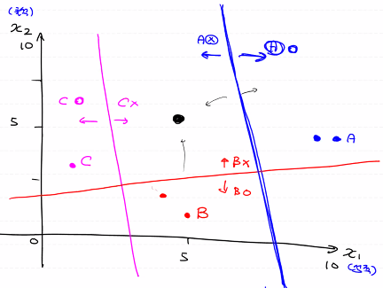
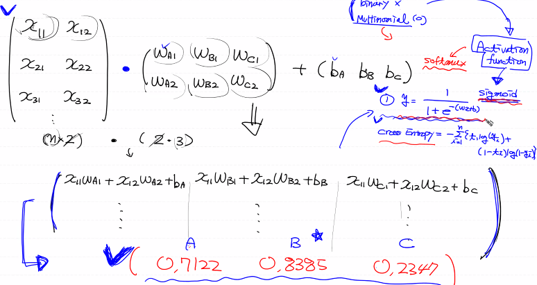
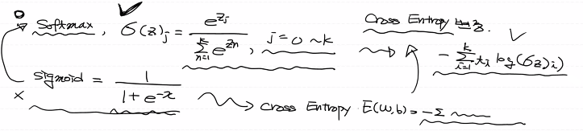
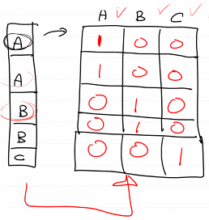

# Multinomial Classification

- 여러개의 분류중에 어떤 분류에 속하는지를 예측

- 초평면(hyperplane)을 구하는 것
- n개의 label을 가지고 있으면 n개의 이진분류로 분류를 진행

- n개의 이진분류를 행열연산을 이용해 하나로 만들기

- Multinomial에서는 sigmoid가 아닌 softmax를 이용한다
  - 그렇기 때문에 loss function도 바뀌게 된다

- label값을 넣어 학습을 진행해야 하기때문에 label을 어떻게 넣을것인지 생각해야함
  - label값이 loss function에서 사용됨
- 이를 위해 One-Hot encoding을 사용해서 label값을 변환
  - loss 계산과정에서 예측결과의 형태가 (-1, label의 수)이기 때문에 label의 형태도 그에 맞게 변환하여야 한다

# BMI 예제

- BMI = 몸무게 / 키^2 = kg / m^2

