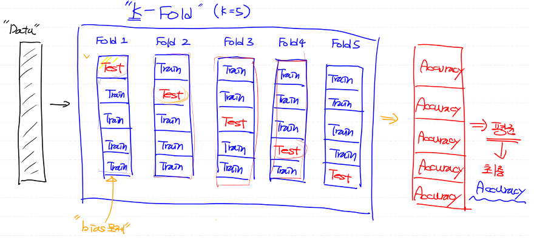

# 그동안 한거

## 1 . 많은 양질의 데이터 

> Data Preprocessing, 데이터 전처리

- 결측치 처리
- 이상치 처리

- 정규화 처리
  - Min-Max Scaling : 0~1사이의 실수
  - Standardization : 동일한 척도로 변환할 수 없음, 하지만 이상치에 둔감
  - Student's T분포

## 2. Model 만들기

- Python : 속도가 느리다
- Sklearn : 정답 확인용
- Tensorflow
- Pytouch
- ...

## 3. Evalueation (평가)

> Metric

- Precision
- Recall
- Accuracy
- F1
- Fall-out 
- Training Data Set을 이용해서 측정하면 안됨
- Training Data Set : 학습용도
  - Training Data Set 
  - Validation Data Set
- Test Data Set : 최종 성능 평가

- Data Set이 충분하지 않은 경우
  - 학습용 데이터가 적어 Under fitting이 발생
  - 이를 해결하기 위해 Epoch수 증가
  - Over fitting 발생

# K - fold Cross Validation (CV)

- BMI 예제
  - 전처리
  - 모델생성
  - K - fold Cross Validation 이용
  - Accuracy