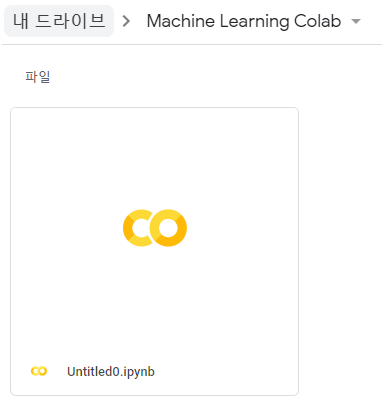

# Google Colab

- cloud 기반의 jupyter notebook
- 무료로 사용 가능 (무료인 경우 Session 시간이 최대 12시간)
- 협업을 할땐 사용하는 colab 이용이 좋다
- 환경설정이 어렵지 않다
- cloud 환경이기 때문에 browser만 있으면 접속해서 사용할 수 있다
- 학습속도는 굉장히 빠르다


## 사용방법

- google drive에 접속
- 새로운 폴더를 만들고 새로 만들기에서 


- google Colaboratory를 확인, 없다면 더보기에서 검색하여 설치


- 새로 만든 폴더에서 google Colaboratory 새로 만들기




- colab에선 Tensorflow 최신버전이 기본으로 설치되어 있다


- 우린 지금 1.15를 이용하고 있기 때문에 재설치를 해야한다

  

- 재설치후 런타임 초기화


- 버전 확인


- 또는 아래의 코드를 이용해서 2.X 버전에서 1.X 버전을 사용할 수 있음

  ```python
  import tensorflow.compat.v1 as tf
  tf.disable_v2_behavior()
  ```

  

# confusion_matrix()

- sklearn에서 제공하는 `confusion_matrix()` 이전에 배운 confusion matrix와 형태가 조금 다르다


- multinomial classification의 경우 confusion matrix


