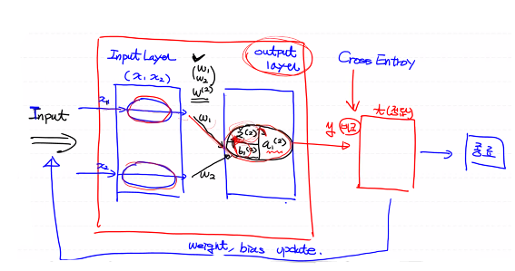

# Tensorflow 2.x

-  지금까지는 TF 1.15사용
  - Low Level API를 이용해서 구현 : 내용을 이해하기에 좋다
- 2.X 버전으로 넘어오면서 많은 변경점이 생겼다
- Tensorflow는 google이 만든 Deep Learning용 Library
  - Tensorflow : google
  - Pytouch : Facebook
  - Keras : 프랑소와 솔레
  - MXNET

- TF 2.0 '2019.09.30'
  - Eager Excution (즉시실행) : 코드의 직관성이 높아짐
  - Keras가 high-level API로 공식적으로 지원

# ML의 rasie and fall

- 1986년 제프리 힌트의 Back propagation (오차 역전파) 알고리즘에 의해 NN 다시 각광

- 2010년 부터 Deep Learning이 본격적으로 발전하기 시작, 대학 연구실과 기업을 중심으로 Deep Learning Library가 만들어지기 시작함
  - 2010 벤지오 - Theano (역사에 기록된 최초의 여성 수학자, 피타고라스의 아내) - 2017년 개발 중지
  - 2013 버클리대학 중국 유학생(가양청) - caffe
  - 2014 로난 - Touch3
  - 2015 카네기멜로대학 - MXNET, google - Tensorflow, 프랑소와 숄레 - Keras

  - 2016 MS - CNTK
  - 2019 TF 2.0 (with 프랑소와 숄레)

# Keras 사용하기

## Keras의 Model

## Logistic Resression

- Keras의 model을 이용해서 표현하기

- Logistic Resression에선 hidden layer는 필요하지 않다
- Output layer엔 Logistic이 있다

- x * w + b = z > sigmoid(z) = a

- model.
- model.add
- model.complie
- model.fit
- model.evaluate
- model.predict

# 결측치 처리
- 데이터 분석 초기 단계, 예측 프로젝트 초기 단계에서 가장 힘든 일 중 하나가 결측치 처리이다
    - 결측치가 전체 데이터에서 비중이 얼마나 되는가?
    - 결측치가 독립변수인지 종속변수인지

## 결측치 처리 방법
1. Deletion(결측치 제거)
    - Listwise 삭제방식
        - NaN이 존재하면 행 자체를 삭제
        - NaN을 제외한 다른 의미있는 데이터가 삭제될 수 있다
        - 데이터가 충분히 많고 NaN의 빈도가 상대적으로 적은졍우 최상의 방법
    - Pairwise 삭제방식
        - 의미있는 데이터가 삭제되는 것을 막기 위해 행 전체를 삭제하지 않는다
        - 해당 결측치만 모든 처리에서 제외한다
        - 문제가 발생할 여지가 있어 특수한 경우에만 사용한다
2. Imputation(결측치 보간)
    - 평균화 기법
        - 평균(mean), 중앙값(median), 최빈값(mode)
        - 장점 : 쉽고 빠르다
        - 단점 : 통계분석에 영향을 많이 미친다
    - 예측 기법
        - 결측치가 종속변수일때 사용할 수 있는 방법
        - 결측치가 완전히 무작위적으로 관측되지 않았다는 것을 가정
- 우리예제에서는 머신러닝 기법 중 KNN을 이용해서 Imputation을 진행할 예정
- 일반적으로 평균화 기법보다는 조금 더 나은 결측치 보간을 할 수 있다

## KNN(K-Nearest Neighbor)

- KNN 알고리즘, K 최근접 이웃
- 장점
  - 상당히 간단한 모델
  - 데이터가 많으면 상당히 정확한 결과를 도출한다
- 단점
  - 데이터가 많으면 거리계산의 시간이 오래 걸린다
- 새로운 값을 기준으로 주변의 K 최근접 이웃이 무엇인지 확인하여 새로운 값을 예측
  - 이를 위해 새로운 값과 기존 값간의 거리를 구할 수 있어야 한다
- Regression 기반으로 KNN을 적용가능
  - 주변 K개의 Label을 평균으로 새로운 값을 예측
- KNN은 학습이라는 절차가 필요하지 않다

  - 새로운 데이터가 들어왔을대 기존 데이터들과의 거리를 계산해 이웃을 뽑아서 예측을 수행하는 기법

  - Instance-based Learning, Lazy Model이라고도 한다
- KNN의 Hyperparameter

  - 이웃의 수 (K)

    - K가 작으면 지역적 특성을 너무 많이 반영하는 Overfitting이 발생할 수 있다
    - K가 크면 Underfitting이 발생한다

  - 거리 측정방식

    - Euclidean distance
- Manhattan distance
    - Mahalanobis distance
- 데이터 정규화를 반드시 진행해야한다
- 1-NN의 오차범위가 이상적인 오차범위의 2배와 같거나 작다 (수학적으로 증명이 되있다 )