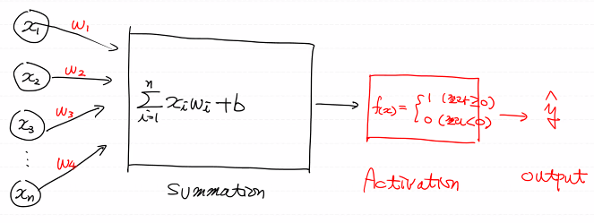

# ML

- Regression

  - linear regression
  - logistic regression
    - binary classification
    - multinomial classification

- KNN

- SVM(Support Vector Machine)

- Decision Tree

- Neural Network(신경망)

- ETC(강화학습, Naive Bayes...)


# Neural Network

- 우리의 최종목표는 AI를 구현하는 것

- 초창기엔 AI를 만들기 위해 사람의 뇌를 연구함
  - 'neuron'이라고 불리는 뇌의 신경세포의 동작으로 '사고'라는 동작이 일어난다
- 이런 내용을 이용해서 1960년대 '로젠 블렛'이 'perceptron' (인공신경망 모델)
  - 다수의 신호를 입력 받아서 하나의 신호를 출력하는 구조


## Single - Layer Perceptron Network



- Logistic Regression과 같다
- computer 회로 기본 단위 : gate
  - AND, OR, XOR, NOT, NAND ...
- 이러한 gate를 Perceptron(Neuron)으로 구현할 수 있으면 이걸 이용해서 AI를 만들수 있다고 생각함

- Perceptron으로 AND, OR gate를 구현하기
  - Logistic Regression으로 AND, OR gate의 진리표(Truth Table)를 학습하여 확인하기

```python
import numpy as np
import tensorflow.compat.v1 as tf
from sklearn.metrics import classification_report
tf.disable_v2_behavior()

# Trainin Data Set
x_data = np.array([[0,0], [0,1], [1,0], [1,1]], dtype=np.float32)

# AND t_data
t_data = np.array([[0], [0], [0], [1]], dtype=np.float32)

# OR t_data
t_data = np.array([[0], [1], [1], [1]], dtype=np.float32)

# XOR t_data
t_data = np.array([[0], [1], [1], [0]], dtype=np.float32)

# placeholder
X = tf.placeholder(shape=[None, 2], dtype=tf.float32)
T = tf.placeholder(shape=[None, 1], dtype=tf.float32)

# W & b
W = tf.Variable(tf.random.normal([2,1]))
b = tf.Variable(tf.random.normal([1]))

# Hypothesis
logit = tf.matmul(X, W) + b
H = tf.sigmoid(logit)

# loss function
loss = tf.reduce_mean(tf.nn.sigmoid_cross_entropy_with_logits(logits=logit, 
                                                              labels=T))

# train
train = tf.train.GradientDescentOptimizer(learning_rate=1e-2).minimize(loss)

# Session
sess = tf.Session()
sess.run(tf.global_variables_initializer())

for step in range(30000):
    _, loss_val = sess.run([train, loss], feed_dict={X : x_data, T: t_data})
    
    if step % 3000 == 0:
        print('loss : {}'.format(loss_val))
        
# Accuracy
accuracy = tf.cast(H >= 0.5, dtype=tf.float32)

result = sess.run(accuracy, feed_dict={X: x_data})
print(classification_report(t_data, result.ravel()))
```

- XOR  Gate는 학습이 안된다
- 1969년 MIT AI Lab founder '마빈 민스키'
  - XOR  Gate는 Single Layer Perceptron으로는 구현 불가
  - MLP(Multi Layer Perceptron)으로 가능하지만 어려움을 수학적으로 증명함

- AI의 침체기