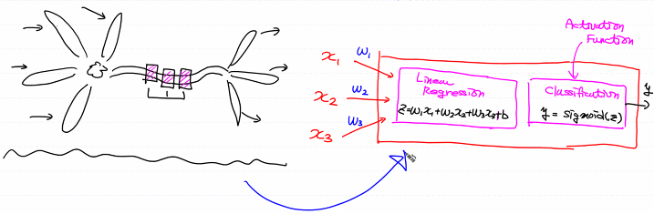
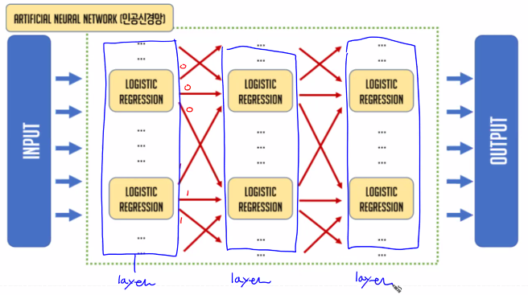
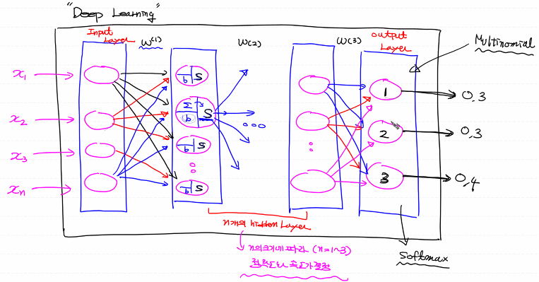

# Neuron

- 이전 뉴런으로부터 입력신호를 전달받아서 또 다른 신호를 발생키시는 일을 한다
- 입력값에 비례해사 출력값을 내보내는 형태가 아니다
- 입력값에 가중치를 곱한후 모두 더해서 특정함수를 이용해 threshhold를 넘는지 확인하여 임계점을 넘으면 출력값을 발생
  - 특정함수 : Activation function
    - sigmoid, softmax...

- Binary Classification : 1 layer안에 Logistic regression이 1개만 존재

- Multinomial Classification : 1 layer안에 Logistic regression이 여러개 존재

# Deep Learning (Deep Neural Network)

- 1개의 Logistic regression를 나타내는 node가 서로 연결되어 있는 신경망 구조를 바탕으로 Input layer(입력층) + 1개 이상의 Hidden layer(은닉층) + Output layer(출력층)으로 구조 

- 출력층의 오차를 기반으로 각 node의 가중치를 학습시키는 ML의 한 분야

- 1개 이상의 Hidden layer를 이용하면 정확도가 높아진다
- Hidden layer를 여러개 사용할 수록 일반적으로 정확도가 올라간다
  - n = 1 or 3 정도까진 정확도가 잘 올라간다, 이 이상으로 올라가면 정확도 증가에 비해 시간이 너무 많이 소요된다
- 장점 : 정확도가 가장 높다 
- 단점 : 학습에 들어가는 시간이 오래 걸린다
  - NVIDIA GPU가 있는 컴퓨터 사용
  - Colab
  - AWS

- Input layer는 data를 전달하는 역할
- Multinomial Classification Model

- Data의 흐름 : Input > Hidden > Output
  - Propagation, Feed forward라고 한다
- W와 b를 반복적으로 갱신하여 학습을 진행
- 이전 Layer의 출력의 개수와 이후 Layer의 입력의 개수가 동일해야 한다

- Fully Connected Network : 이전 Layer와 이후 Layer가 완전히 연결된 상태
  - DNN은 기본적으로 Fully Connected Network이다
  - 이렇게 앞, 뒤 Layer와 완전히 연결된 것을 Layer를 Dense라고 한다
  - 위의 그림에선 모든 Hidden Layer가 전부 Dense Layer이다

# XOR Gate 구현

- Input Layer 1개 , Node 2개
- Hidden Layer 2개, Node 10개, 6개
- Output Layer 1개, Node 1개 (0 or 1)
- Tensorflow 1.15와 Tensorflow 2.x로 구현

# W 초기화 문제

- W를 랜덤으로 지정하여 사용하면 항상 다른 결과를 얻게되므로 같은 설정인데 학습이 제대로 진행이 될 경우도 있고 그렇지 않은 경우도 있다
- 이러한 문제를 해결하기 위한 W 초기화법 + 활성화 함수로 Relu 사용

