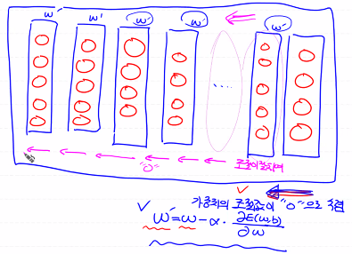

# Colab Connection 유지 Script

```javascript
function ClickConnect(){
    console.log("코랩 연결 끊김 방지 - 2020년 8월버전");
    document.querySelector("#top-toolbar > colab-connect-button").shadowRoot.querySelector("#connect").click();    
}
interval_result = setInterval(ClickConnect, 120 * 1000)

console.log("코랩 연결 끊김 방지 Script 중지 - 2020년 8월버전");
clearInterval(interval_result)
```


# XOR Gate

- Single-Layer-Perceptron으로 학습이 불가능
- Multi-Layer-Perceptron으로 학습이 가능
  - 하지만 적절한 학습방법을 찾기가 힘들다
  - 시간이 오래 걸린다


# 오차 역전파(Back Propagation)

- 1974년 웨어보스 획기적인 논문을 발표
- 1982년 다시 한번 논문 발표
- 1986년 제프리 힌튼 해당 논문 재발견 > AI가 다시 흥행

- 미분을 행렬곱연산으로 해결


## 문제점

- Layer의 갯수가 많아지면 Vanishing gradient 현상 발생
- 가중치의 조절값이 0으로 수렴 > 뒤에서 앞으로 갈수록 가중치의 조절이 잘 되지 않는다



- 이 문제로 다시 AI(Neural network) 침체기

- 이후 KNN, SVM, Naive Bayes, Decision Tree등 다양한 알고리즘이 각광을 받는다.

- 1990년대 Hinton, CIFAR에 참여해서 캐나다에서 Neural Network 연구
- 2006,2007년 초기화, Activation Function에 대한 논문 발표

- 2010년 Xavier Initialization 
- 2015년 He's Initialization 


# Weight 초기화 방법

##  Xavier Initialization

- 입력의 개수와 출력의 개수를 이용해서 Weight의 초기값을 결정하는 방법

```python
# 수식으로 구현하기
W = np.random.randn(num_of_input, num_of_output) / np.squrt(num_of_input)
# Tensorflow 1.15에서 구현하기
W = tf.get_variable('W', shape=[num_of_input, num_of_output],
                     initializer=tf.contrib.layers.xavier_initializer())
```


## He's Initialization 

- Xavier Initialization의 확장 버전

```python
# 수식으로 구현하기
W = np.random.randn(num_of_input, num_of_output) / np.squrt(num_of_input/2)
# Tensorflow 1.15에서 구현하기
W = tf.get_variable('W', shape=[num_of_input, num_of_output],
               initializer=tf.contrib.layers.variance_scaling_initializer())
```


# 활성화 함수

- Relu

```python
# 지금까지 사용했던 활성화 함수
# 이 활성화 함수를 사용해서 문제가 생김
tf.sigmoid()
# 그 문제를 개선하기 위해 사용하는 Relu
tf.nn.relu()
```


# 과대적합(Over Fitting)

- Training Data에 대해 너무 적합하게 학습이 진행된 경우
- 실제 Data 예측에서 오히려 성능이 떨어지는 경우


## 해결방법

1. 데이터양이 많아야 한다

2. 필요없거나(종속변수에 영향을 미치지 않는) 중복이되는 feature를 삭제한다

3. L2 정규화 : 인위적으로  W의 값을 조절하는 방법

4. DNN에서는 `Dropout`이라는 방법으로 해결 가능

   - 학습에 참여하는 각 Layer안의 일정 Node를 사용하지 않는 기법

   ```python
   # Tensorflow 1.x dropout
   _layer = tf.nn.relu(tf.matmul(X, W) + b)
   layer = tf.nn.dropout(_layer, rate=0.3)
   # Tensorflow 2.x dropout
   model.add(Dropout(0.2))
   ```

   