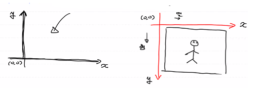
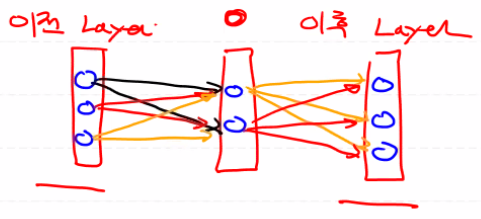
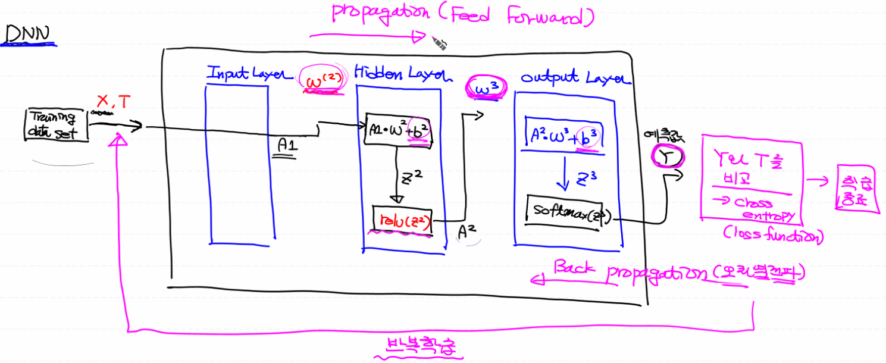
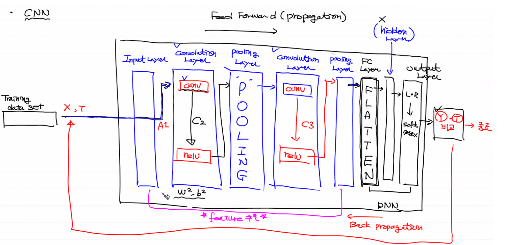

# 이미지 학습

- CNN을 이용한 이미지 학습 및 예측
- Digital Image에 대한 기본적인 이해

- 이미지를 이루고 있는 가장 기본적인 단위 : Pixel > 해상도는 픽셀의 개수
  - 해상도가 높다 > 픽셀의 개수가 많다

- 이미지는 우리가 사용하는 데카르트 좌표계와 다른 이미지 좌표계를 사용한다

- 이미지 좌표계는 행렬구조이다

- pixel = [세로(x), 가로(y)]

## Digital Image의 형태

- Binary Image(이진 이미지)
  - 각 Pixel의 값을 0,1 (어두움, 밝음)로 표현
  - 각 Pixel을 1 bit만 있으면 표현이 가능
  - 실제로 1개의 pixel은 8 bit를 사용하도록 할당됨
  - 7 bit를 낭비함 (8 bit를 다 사용하는 경우는 gray-scale)

-  Gray-scale Image(흑백 이미지)
  - 각 pixel의 값을 0~255 사이의  값으로 표현
  - 2^8 = 256, 1개의 pixel은 8 bit를 사용하기 때문에 
  - 2차원으로 표현 할 수 있고, 3차원으로도 표현 할 수 있다
- Colar Image
  - 3개의 chanel이 포함된
    - 각 chanel은 빛의 3원색인 R,G,B의 색상값을 표현 (0~255)
  - 각 chanel당 8 bit가 필요하므로 하나의 pixel을 표현할때 24 bit가 필요하다 > True Colar
  - png 파일은 추가로 A chanel (투명도)이 포함되어 있다 > 32 bit
- 이미지의 형태만 파악할 것인가? > 흑백 ex) 불량 여부
- 이미지의 색상이 필요한 가? > 컬러

# CNN

> Convolutional Neural Network (Convent), 합성곱 신경망

- DNN(Deep Neural Network) : 일반적인 Deep Learning의 구조

- FC Layer (Fully Conected Layer) : 일반적으로 DNN과 같은 의미로 혼용해서 사용됨

  - 이전 Layer의 모든 Node와 다음 Layer의 모든 Node와 연결된 상태

  

  - Dense Layer라고 표현한다

- 이미지 학습 > 사물의 특징을 찾아내서 사물을 판별

- Image의 데이터를 있는 그대로 학습하는 방식은 좋지 않다

- CNN

  - 이미지를 분류하기 위해 이미지의 Pattern을 이용하는 Deep learning 방법론
  - 이미지의 Pattern을 수동으로 추출하지 않는다
  - 알고리즘을 이용해서  Pattern을 추출

  - 이미지를 이용하는 모든 분야에서 사용됨

- ImageNet 경진대회에서 CNN 등장

## CNN 이전의 이미지 분석

- FC Layer로만으로 구성된 DNN의 입력 데이터는 1차원으로 한정됨 > Flatten()을 이용해서
- CNN이 나오기전에는 이미지 인식을 위해 이전에 했던 MNIST 예제처럼 데이터를 1차원으로 변형해서 FC Layer에 입력했음 
  - 이미지의 Feature는 고려하지 않고 많은 양의 데이터를 직접 이용해서 학습을 진행
  - 시간이 오래걸린다
  - 같은 사진이라도 방향이 달라지면 인식을 할 수 없다

## CNN

