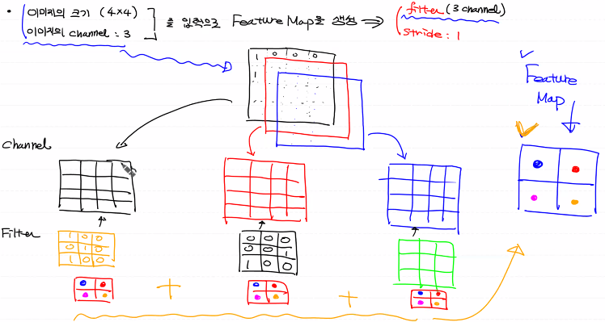
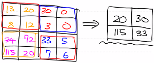

# 이미지 처리

- 기존 DNN을 이용해서 Image를 학습하는 것은 여러가지 한계점이 존재
- 사람이 그림을 판별하듯 이미지의 특징을 추출해서 학습해서 예측하는 방법 > CNN

# Convolution(합성곱)

- 두 함수 f,g가 존재할때 하나의 함수를 반전(reverse), 전이(shift)시킨 후 다른 함수와 곱한뒤 그 결과를 적분하는 방법

# Channel

- 이미지 pixel의 하나하나는 실수값을 갖는다.
- Color인 경우 각 pixel을 RGB 3개의 실수로 표현
- Color 이미지는 3차원으로 표현 > R,G,B 3개의 channel로 구성
  - (height, width, 3) >  3차원(channel : 3)
- Gray-Scale(흑백) 이미지는 2차원 데이터로 표현이 가능
  - (height, width) > 2차원
  - (height, width, 1)로 표현이 가능 > 3차원(channel : 1)

- 일반적인 이미지를 처리할때 전처리 과정을 통해 이미지를 흑백으로 변환하여 처리한다
  - 즉, channel을 '1'로 만들어서 처리
  - 연산량을 줄이고 색상으로 인한 오차를 줄이기 위해서
  - 이미지의 형태만을 이용해서 학습을 진행

# Filter & Stride

- 이미지의 특징을 찾아내기 위한 공용 parameter
- 학습을 통해서 filter가 변한다

- 다른말로 Kernel이라고도 한다

- 일반적으로 3x3, 4x4와 같은 정방형 형태로 정의
- 이 filter안의 구성요소들이 CNN에서의 학습의 대상
- 이미지의 특징을 여러개 추출하기 위해서 여러개의 filter를 사용한다
  - 이러한 filter는 사이즈가 큰 filter를 사용하는 것 보다 사이즈가 작은 filter를 여러개 사용한것이 좋다
  - 보통 3x3 size filter를 주로 사용한다
- filter를 이미지 위에서 지정된 간격만큼 이동하면 convolutuin 수행
  - 이때 간격을 stride라고 한다

- stride의 값이 커지면 convolution 연산 결과의 개수가 작아진다

- channel과 feature map은 연관이 없고, filter의 size와 stride에 영향을 받는다
- feature map은 원래 이미지의 특징을 부각 시킨 새로운 이미지이다
- 만약 filter가 여러개면 feature map도 여러개
  - 이러한 여러개feature map을 feature map의 channel이라고 한다
- feature map에 Relu를 이용하여 activation map 생성

# Padding

- feature map은 입력 데이터보다 크기가 작아진다
  - 지속적으로 데이터가 작아지는 것을 방지하는 방법이 Padding

- 입력 데이터 외곽에 0을 재워서 처리(zero padding)
  - 0은 이미지의 특징에 영향을 주지 않기 때문에 사용됨
- Code를 이용해서 Padding을 처리할때 (TF 1.x)
  - VALID : padding을 사용하지 않는 옵션 > 입력보다 출력의 크기가 작아진다
  - SAME : padding을 사용하는 옵션 >  입력과 출력의 크기를 같도록 만드는 것

# Pooling

- stride와 kernel size에 따라서 feature map의 size가 결정됨
  - 일반적으론 feature map은 입력 데이터 보다 크기가 작다

- filter의 수만큼의 feature map이 생성됨 

  - 예를 들어 filter의 channel이 100이면 1장의 이미지를 이용할때 100개의 feature map이 생성됨 > channel이 100
  - 학습해야하는 데이터양이 많아진다

- 특정 feature를 강조하고 데이터양을 줄이기 위해 pooling을 사용한다

  - MAX pooling : CNN의 기본 pooling 방법

    - kernel size (2x2)

    

  - Average pooling

  - MIN pooling