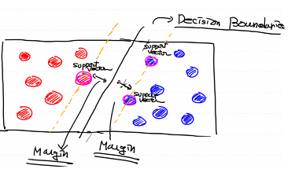
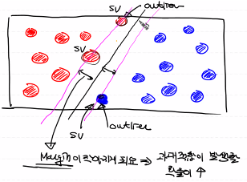
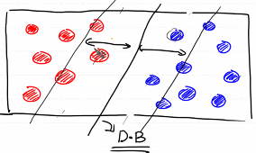
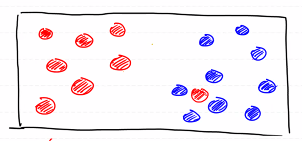
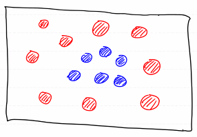

# ML

## Regression

- Linear Regression
- Logistic Regression
- Multinomial Classification

## Neural Network

- DNN
- CNN

## KNN(K-Nearest Neighbor)

## SVM(support vector machine)

- Regression, Classification
- 성능은 Deep Learning에 비해 살짝 떨어진다
- 모델 자체가 가벼워 속도, 메모리 측면에서 이점이 있다

# SVM

- Decision Boundaries(결정경계)라는 개념을 이용해서 분류를 하기 위한 기준선을 만듦

- 데이터를 선형으로 분리하는 최적의 결정경계를 찾는 알고리즘

- Support Vector : Decision Boundaries에 가장 근접한 벡터
- Margin : Support Vector와 Decision Boundaries간의 거리

- Margin이 최대가 되는 Decision Boundaries를 찾기
- Support Vector만 고려하기 때문에 속도가 빠르다

- 대신 이상치 처리에 주의해야 한다

- 이상치가 있으면 Margin이 작아지고 그로인해 과대적합이 발생할 확률이 증가한다
  - 이러한 상황을 Hard Margin이라고 함
- 이와 반대인 Margin이 큰 상황을 Soft Margin이라고 함
  - Underfittiong이 발생할 수 있다

- 데이터가 아래 그림처럼 혼재되어 있는경우 선형으로 데이터를 분리하기 힘들다

## Regularization

- 이 문제를 해결하기 위해 테이터 오류를 허용하는 전략이 만들어짐
- Sklearn에선 c(cost)라는 hyper parameter를 이용한다
  - 얼마나 많은 데이터가 다른 범주에 놓이는 것을 허용할지
  - 기본값은 1, 이 값이 클수록 다른 범주에 놓이는 데이터 포인트를 적게 허용
- c가 클수록 Margin이 작이지고(과대적합), c가 작을수록 Margin이 커진다(과소적합)

## Kernel

- kernel이라는 hyper parameter
  - ploy로 바꾸면 2차원을 3차원으로 사상
  - 두 데이터를 나누는 면을 찾을 수 있음

- 기본값은 rbf(Radial Bias Function, 방사기저함수)
  - 데이터를 상위 차원의 데이터로 사상시키는 역할
  - 가우시안 kernel이라고도 표현함
- ploy나 rbf를 이용하면, gamma라는 hyper parameter를 지정해야 한다
  - Decision Boundaries를 얼마나 유연하게 그릴것인지에 대한 정도
  - gamma가 낮으면 Decision Boundaries가 직선에 가까움(과소적합)
  - gamma가 높으면 Decision Boundaries가 세밀하게 그린다(과대적합)

# Hyper Parameter 조절

- SVM Model을 만드는건 어렵지 않다
- 하지만 Hyper Parameter를 조절해서 최적화하는 작업은 쉽지 않다
  - Hyper Parameter를 조절하는 과정을 자동화할 수 없나?

## Sklearn

- Grid Search CV 
  - Hyper Parameter의 값을 몇개 정해주면 그 값을 모두 이용해서 결과를 출력
- Randomize Search CV
  - 범위를 지정하면 랜덤하게 추출해서 CV를 진행