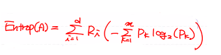

# Decision Tree(의사결정나무)

- 데이터를 분석해서 이들 사이에 존재하는 패턴을 파악하여 예측가능한 규칙들의 조합을 만드는 알고리즘

- 기본적인 구조
  - Root node : 첫 시작 node
  - Intermediate node : 중간 node
  - Terminal(leaf) node : 마지막 node

- 장점
  - 굉장히 직관적이고 친근한 방식
  - 다른 모델에 비해 빠르고 간단
  - 데이터의 특성에 따하 다른 모델에 비해 더 좋은 성능을 내는 경우가 있음
    - 독립변수와 종속변수 둘다 이산 데이터인 경우
    - Classification 문제에서 class 개수가 적을때 적합
    - 데이터의 개수가 많을때

## Decision Tree 이론

- 의사결정트리 학습 진행 방향 : 영역을 분기한다는 의미
  - 영역의 순도(Homogeneity)가 증가하는 방향
  - 불순도(Impurity)가 감소하는 방량
  - 불확실성(Entropy)이 감소하는 방향

- 순도가 증가/불확실성이 감소하는 것을 정보이론(Information Theory)쪽에서는 정보획득(Information Gain)이라고 함
- 정보획득량 : 어떤 사건이 얼마만큼의 정보를 줄 수 있을지를 수치화
  - 정보함수 : I(x) = log(1/P(x))
    - 정보함수의 값이 크면 그 정보가 가치가 있다는 것
    - P(x)가 작을수록 I(x)가 커진다 : 희소한 일에 대한 정보가 가치가 크다
  - Entropy
    - 무질서도를 정량화한 값
    - 확률변수의 불확실성을 수치로 표현
    - Entropy가 높다면 특징을 찾아내기 힘들고, 불확실성이 높아진다
    - 불확실한 상황에서 확실한 상황으로 전이될때 정보량이 많아진다
    - 정보획득량 : 전체 Entropy - 분류 후 Entropy
    - A영역에 대한 Entropy를 나타내는 식(영역이 하나인 경우)
      - Pk : A영역에 속하는 데이터 가운데 k범주에 속하는 데이터의 비율

    - A영역에 대한 Entropy를 나타내는 식(영역이 하나 이상인 경우)
      - Ri : 분할전 데이터 가운데 분할후 i영역에 속하는 데이터 비율

## Decision Tree 단점

- 현재의 데이터만 가지고 tree생성
- Greedy 알고리즘을 이용하기 때문에 최적의 tree를 구성하지 못할 수 있음
- Overfitting이 심하다