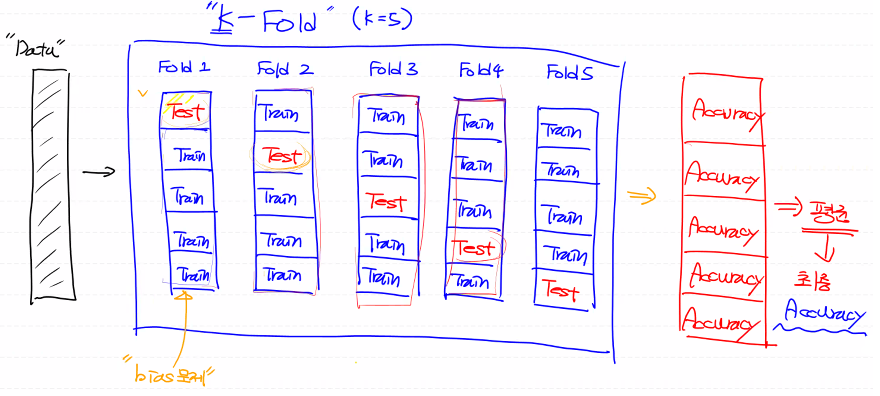

# ML 정리

## ML에 대한 기본 사항

- AL : 인간이 가지는 특유의 학습능력, 추론능력을 컴퓨터로 구현하려는 가장 포괄적인 개념
- Machine Learning은 AI를 구현하는 다양한 방법론중 하나로 데이터의 특성과 패턴을 학습하여 미지의 데이터에 대한 추정치를 계산하는 프로그래밍 기법
  - Regression(회귀)
  - SVM(Support Vector Machine)
  - Decision Tree
  - Random Forest
  - Naive Bayes
  - KNN
  - Neural Network(신경망)
    - 신경망을 이용해서 학습하는 구조와 알고리즘이 최근에 개선, 개발됨 
    - Deep Learning라고도 부름(CNN, RNN, LSTM, GAN...)
  - Clustering(K-Means, DBSCAN)
  - Reinforcement Learning(강화학습)

- Data Mining과 차이점 
  - Data Mining은 데이터의 특성간 상관관계, 새로운 특성을 알아내기에 주목
- ML의 4가지 학습방법
  - 지도 학습(Supervised Learning)
  - 비지도 학습(Unsupervised Learning)
  - 준지도 학습(Semi-supervised Learning)
  - 강화 학습(Reinforcement Learning)

- 수치미분


## Regression 

### Regression의 기본 

- 데이터를 가장 잘 설명하는 모델을 찾는것

  - 2차원 데이터의 경우 직선, 3차원 데이터의 경우 평면...

- 모델은 회귀계수와 오차항으로 이루어져있다

- Classical Linear Regression Model

  - 오차항의 평균은 0이고 정규분포를 따른다
  - 독립변수와 종속변수는 선형관계를 따른다
  - 데이터에 이상치가 없어야 한다
  - 독립변수와 오차항은 독립이다

  - 단변량 선형 회귀모델

  - 단순 선형 회귀모델(독립변수 1개)
  - 다중 선형 회귀모델(독립변수 2개 이상)

- 오차 ( error) = t - y = t - (Wx + b)

  - 평균 제곱 오차(MSE)

- loss function(손실함수)

  - loss의 최소값을 찾기위해 GD 사용

### GD

- GD의 한계
- grobal minimun과 local minimun이 다르면 grobal minimun을 찾지 못할 수 있다
- 초기의 W값에 따라 구하는 최솟값이 다를 수 있다
- 그래서 Loss Function이 볼록함수(convex function) 형태여야 최솟값을 원활히 구할 수 있다


## 데이터 전처리

### 이상치

- 성안에 들어있는 값이 일반적인 값에 비해 편차가 큰 값을 지칭
- 독립변수 측에 있는 이상치 > 지대점
- 종속변수 측에 있는 이상치 > `outlier`
  - 이러한 이상치는 찾아야 처리할 수 있다

- 이상치 검출 방식
  - Variance : 정규분포
  - Likelihood : 베이즈 정리를 이용(확률)
  - Nearnest-Neighbor : 모든 데이터쌍의 거리를 이용
  - Density : 카이제곱 분포 이용
  - ...
  - Tukey fence : 사분위 > boxplot을 이용해서 이상치를 graph에서 확인
  - Z - score : 정규분포와 표준편차

```python
# boxplot를 이용해서 이상치 확인
boxplot(data)
# Zscore를 이용해서 이상치 확인
outlier = np.abs(stats.zscore(data))
# 이상치를 이용해서 data에서 이상치 제거
np.isin(data, outlier, invert=True)

# 또는 정상치 불리언 마스크를 생성해서 이상치 제거
tmp = ~(np.abs(stats.zscore(data['Ozone'])) > zscore_threshold)
training_data = data.loc[tmp]
```


### 결측치

```python
# 결측치 확인
.isnull().sum()
# 결측치 제거
dropna(how='any')
```


### 데이터 정규화

- 비율을 이용해서 data의 scale을 조정 ex) 0~1
- min- max Normalization
  - 데이터 정규화의 가장 일반적인 방법
  - 모든 feature의 값을 최솟값 0, 최댓값 1로 변환
  - Xscaled = X - Xmin / Xmax - Xmin
  - 이상치에 상당히 민감하다
  - 이상치 처리를 반드시 하고 사용해야 한다
- z-score Normalization (standardiztion : 표준화)
  - Xscaled =X - Xmean / Xstd
  - 장점 : 이상치에 크게 영향을 받지 않는다
  - 단점 : 동일한 scale을 적용할 수 없다
- 정규화를 진행하면 나중에 예측을 진행할때도 정규화한 값을 이용해야 한다


## Logistic Regression

- Classification 알고리즘 중에 정확도가 높은 알고리즘

- Logistic Regression에선 직선이 아닌 Sigmoid함수를 사용 (y의 값이 0~1)
  - 그 값이 0.5 이상이면 1을 출력
  - 0.5 미만이면 0을 출력

- Logistic Regression Model = 1 / (1 + e^-(Wx + b))
- Logistic Regression의 Loss 함수를 재정의 > Cross Entropy(Log Loss)


## 분류성능 평가지표

### Confustion Matrix

1. Precision(정밀도)

   - 모델이 True라고 예측한 것중 실제 True인 것의 비율
   - TP / TP + FP
   - Positive 정답률, PPV(Positive Predictive Value)라고도 한다


2. Recall(재현율)

   - 실제 True인 것중에 모델이 True라고 예측한 것의 비율
   - TP / TP + FN
   - 민감도, Sensitiviy, Hit rate라고도 한다


- Precision vs Recall

- 입력된 사진에 고양이가 있는지를 검출하는 소프트웨어
  - 이 기술의 고양이 검출율은 99.9%
  - 이 기술의 고양이 검출율은 63.7%
    - '이 기술은 "오검출"을 하지 않는다'라고 생각을 전제로 한다
  - A 기술 99.9%의 검출율 + 그림 1장당 평균 5건의 오검출
  - B 기술 63.7%의 검출율 + 오검출이 거의 없다
- Recall : 고양이를 빠뜨리지 않고 얼마나 잘 검출하는지 나타내는 지표
- Precision : 검출한 결과가 얼마나 정확한지 나타내는 지표
- 일반적으로 Recall과 Precision은 상충관계
- Precision - Recall Graph


3. Accuracy(정확도)

- 앞의 두 지표는 True를 True로 옳게 예측한 경우에 대해서만 고려함
- 전체에서 실제 True를 True라고 예측하거나 실제 False를 False라고 예측한 비율
- TP + TN / TP + FN + FP + TN
- Domain의 bias를 반드시 고려해야 한다


 4. F1 score

- Precision과 Recall의 조화평균

- 2 * Precision* Recall / Precision + Recall


 5. Fall-out

- FP / TN + FP
- 실제 False인데 Model이 True로 잘목 예측한 것의 비율


 6. ROC curve

- Recall & Fall-out를 그래프로 표현


## Overfitting(과대적합) & Underfitting(과소적합)

- Overfitting (과대적합)
  - Model이 Training Data Set에 딱 들어맞는 형태로 만들어진 경우
  - 새로운 데이터를 제대로 예측하지 못한다

- Underfitting(과소적합)
  - 학습이 충분히 진행되지 않은 경우
  - Model이 미완성인 상태이므로 반복을 더 해야 한다

- Overfitting (과대적합)에 영향을 주는 요인
  - Epoch수
  - Data의 양(많은 Data가 필요)
    - 가진 Data가 별로 없는 경우 어떻게 해결해야 하는가?

  - Feature의 개수
    - 개수가 많을수록 Overfitting이 잘 일어난다
    - 중복되는 Feature를 제거하는 것이 좋다
    - 종속변수에 영향을 미치지 않는 Feature를 제거하는 것이 좋다


## Multinomial Classification

- 여러개의 분류중에 어떤 분류에 속하는지를 예측

- 초평면(hyperplane)을 구하는 것
- n개의 label을 가지고 있으면 n개의 이진분류로 분류를 진행

- Multinomial에서는 sigmoid가 아닌 softmax를 이용한다
  - 그렇기 때문에 loss function도 바뀌게 된다
- label값을 넣어 학습을 진행해야 하기때문에 label을 어떻게 넣을것인지 생각해야함
  - label값이 loss function에서 사용됨
- 이를 위해 One-Hot encoding을 사용해서 label값을 변환
  - loss 계산과정에서 예측결과의 형태가 (-1, label의 수)이기 때문에 label의 형태도 그에 맞게 변환하여야 한다


## K - fold Cross Validation



## KNN

- KNN 알고리즘, K 최근접 이웃
- 장점
  - 상당히 간단한 모델
  - 데이터가 많으면 상당히 정확한 결과를 도출한다
- 단점
  - 데이터가 많으면 거리계산의 시간이 오래 걸린다
- 새로운 값을 기준으로 주변의 K 최근접 이웃이 무엇인지 확인하여 새로운 값을 예측
  - 이를 위해 새로운 값과 기존 값간의 거리를 구할 수 있어야 한다

- KNN은 학습이라는 절차가 필요하지 않다
  - 새로운 데이터가 들어왔을대 기존 데이터들과의 거리를 계산해 이웃을 뽑아서 예측을 수행하는 기법

  - Instance-based Learning, Lazy Model이라고도 한다

- KNN의 Hyperparameter

  - 이웃의 수 (K)

    - K가 작으면 지역적 특성을 너무 많이 반영하는 Overfitting이 발생할 수 있다
    - K가 크면 Underfitting이 발생한다

  - 거리 측정방식

    - Euclidean distance
    - Manhattan distance
    - Mahalanobis distance
- 데이터 정규화를 반드시 진행해야한다
- 1-NN의 오차범위가 이상적인 오차범위의 2배와 같거나 작다 (수학적으로 증명이 되있다 )