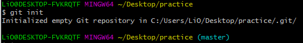
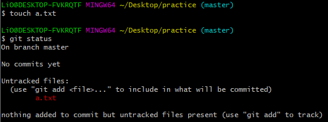
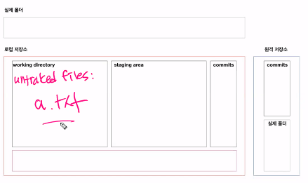
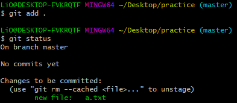
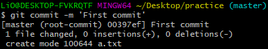
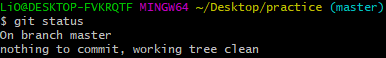
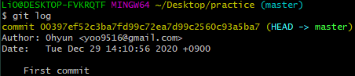
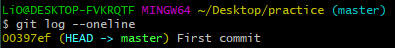
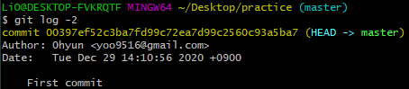

# git 기초

> 분산버전관리시스템(DVCS)

## 0. 로컬 저장소(repository) 설정

- git init(항상 어떤 디렉토리에 있는지 확인하기)

```bash
$ git init
# 초기화 되었다
Initialized empty Git repository in C:/Users/LiO/Desktop/practice/.git/
```



- .git 폴더가 생성되고, 여기에 모든 git과 관련된 정보들이 저장된다.

## 기본 작업 흐름

> 모든 작업은 touch로 파일을 만드는 것으로 대체

### 1. add

```bash
$ git add . # . : 현재 디렏토리(하위 디렉토리 포함)
$ git add a.txt # 특정 파일
$ git add my_foler/ # 특정 폴더
$ git add a.txt b.txt c.txt # 복수의 파일
```

- working directory의 변경사항(첫번째 통)을 staging area(두번째 통)상태로 변경 시킨다.

- 커밋의 대상 파일을 관리한다.

```bash
$ touch a.txt
$ git status
On branch master

No commits yet
# 트래킹이 되고 있지 않은 파일들
# 새로 생성된 파일
Untracked files:
  # add 명령을 사용해
  # 커밋이 될 것에 포함시키기 위하여
  # staging area로 옮기기 위해서
  (use "git add <file>..." to include in what will be committed)
        a.txt

nothing added to commit but untracked files present (use "git add" to track)

```





- add 이후

```bash
$$ git add .
$ git status
On branch master

No commits yet
# add 이후 달라짐
# 커밋이 될 변경사항
# staging area에 있는 애들
Changes to be committed:
  (use "git rm --cached <file>..." to unstage)
        new file:   a.txt

```




### 2. commit

``` bash
$ git commit -m 'First commit'
[master (root-commit) 00397ef] First commit
 1 file changed, 0 insertions(+), 0 deletions(-)
 create mode 100644 a.txt
```



- `commit`은 지금 상태를 스냅샷을 찍는다
- 커밋 메세지(-m)는 지금 기록하는 이력을 충분히 잘 나타낼 수 있도록 작성한다.
- `git log`명령어를 ㅌ오해 지금까지 기록된 커밋을 확인할 수 있다.

```bash
$ git status
On branch master
nothing to commit, working tree clean
```




## 기타 명령어

### 1. status

> 로컬 저장소의 상태

```bash
$ git status
```

### 2. log

> 커밋 히스토리

```bash
$ git log
commit 00397ef52c3ba7fd99c72ea7d99c2560c93a5ba7 (HEAD -> master)
Author: 0hyun <yoo9516@gmail.com>
Date:   Tue Dec 29 14:10:56 2020 +0900

    First commit
$ git log --oneline
$ git log -2
$ git log --oneline -1
```








### add를 한 다음 커밋을 하는 이유(staging area의 존재 이유)

- 원하는 변경사항을 취사선택하여 관리하기위해서

- 여러 파일을 동시에 수정한 경우 원하는 파일만 `add`해서 staging area로 옮긴뒤 커밋하여 원하는 변경사항만 선택하여 관리할 수 있다.

### `status`명령어의 중요성

- CLI 환경이기 때문에 변경사항을 한눈에 파악하기 힘들다.