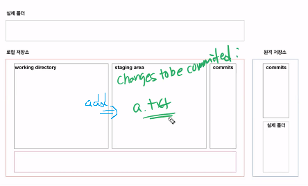
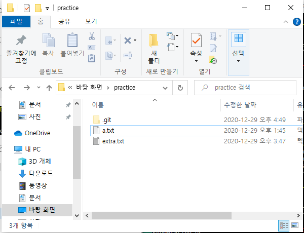
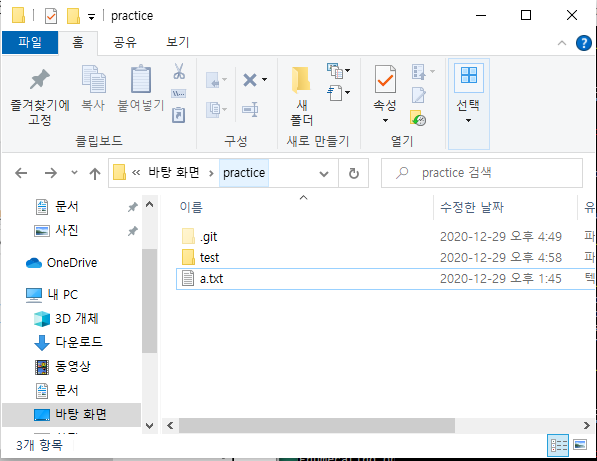
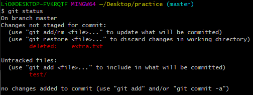
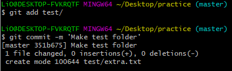
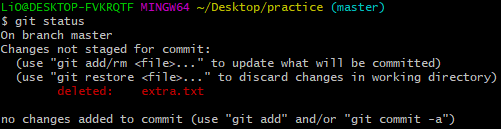
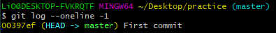

# git 기초

> 분산버전관리시스템(DVCS)

## 0. 로컬 저장소(repository) 설정

- git init(항상 어떤 디렉토리에 있는지 확인하기)

```bash
$ git init
# 초기화 되었다
Initialized empty Git repository in C:/Users/LiO/Desktop/practice/.git/
```


- .git 폴더가 생성되고, 여기에 모든 git과 관련된 정보들이 저장된다.

## 기본 작업 흐름

> 모든 작업은 touch로 파일을 만드는 것으로 대체

### 1. add

```bash
$ git add . # . : 현재 디렏토리(하위 디렉토리 포함)
$ git add a.txt # 특정 파일
$ git add my_foler/ # 특정 폴더
$ git add a.txt b.txt c.txt # 복수의 파일
```

- working directory의 변경사항(첫번째 통)을 staging area(두번째 통)상태로 변경 시킨다.

- 커밋의 대상 파일을 관리한다.

```bash
$ touch a.txt
$ git status
On branch master

No commits yet
# 트래킹이 되고 있지 않은 파일들
# 새로 생성된 파일
Untracked files:
  # add 명령을 사용해
  # 커밋이 될 것에 포함시키기 위하여
  # staging area로 옮기기 위해서
  (use "git add <file>..." to include in what will be committed)
        a.txt

nothing added to commit but untracked files present (use "git add" to track)

```


- add 이후

```bash
$$ git add .
$ git status
On branch master

No commits yet
# add 이후 달라짐
# 커밋이 될 변경사항
# staging area에 있는 애들
Changes to be committed:
  (use "git rm --cached <file>..." to unstage)
        new file:   a.txt

```




### 2. commit

``` bash
$ git commit -m 'First commit'
[master (root-commit) 00397ef] First commit
 1 file changed, 0 insertions(+), 0 deletions(-)
 create mode 100644 a.txt
```


- `commit`은 지금 상태를 스냅샷을 찍는다
- 커밋 메세지(-m)는 지금 기록하는 이력을 충분히 잘 나타낼 수 있도록 작성한다.
- `git log`명령어를 ㅌ오해 지금까지 기록된 커밋을 확인할 수 있다.

```bash
$ git status
On branch master
nothing to commit, working tree clean
```


- 커밋은 변경사항을 기록하기 위한 것

그렇기 때문에 변경 사항이 일어난 폴더를 전부 커밋하는 것이 옳은것 같다



practice 폴더에 현 상태




test라는 새로운 폴더를 생성하고 extra.txt를 test 폴더로 이동


```bash
$ git status
On branch master
Changes not staged for commit:
  (use "git add/rm <file>..." to update what will be committed)
  (use "git restore <file>..." to discard changes in working directory)
        deleted:    extra.txt

Untracked files:
  (use "git add <file>..." to include in what will be committed)
        test/

no changes added to commit (use "git add" and/or "git commit -a")
```



새로운 폴더가 생겼고 extra.txt가 사라진 것을 확인할 수 있다


```bash
$ git add test/
$ git commit -m 'Make test folder'
[master 351b675] Make test folder
 1 file changed, 0 insertions(+), 0 deletions(-)
 create mode 100644 test/extra.txt
```



이때 test 폴더만 `add`하여 `commit`한 경우 


```bash
$ git status
On branch master
Changes not staged for commit:
  (use "git add/rm <file>..." to update what will be committed)
  (use "git restore <file>..." to discard changes in working directory)
        deleted:    extra.txt

no changes added to commit (use "git add" and/or "git commit -a")
```



아직 extra.txt의 파일이 지워진 변경 사항이 남아있음을 알 수 있다

즉, test파일에 extra.txt를 넣었지만 extra.txt가 prcatice 폴더에서 사라진 것이 test 폴더만 `add`하여 `commit`한 경우에 반영이 되지 않은 것

따라서 이 경우 prcatice 폴더를 `add`하여 `commit`해야 한번에 모든 변경 사항을 기록할 수 있을 것이다


## 기타 명령어

### 1. status

> 로컬 저장소의 상태

```bash
$ git status
```

### 2. log

> 커밋 히스토리

```bash
$ git log
commit 00397ef52c3ba7fd99c72ea7d99c2560c93a5ba7 (HEAD -> master)
Author: 0hyun <yoo9516@gmail.com>
Date:   Tue Dec 29 14:10:56 2020 +0900

    First commit
$ git log --oneline
$ git log -2
$ git log --oneline -1
```




### add를 한 다음 커밋을 하는 이유(staging area의 존재 이유)

- 원하는 변경사항을 취사선택하여 관리하기위해서

- 여러 파일을 동시에 수정한 경우 원하는 파일만 `add`해서 staging area로 옮긴뒤 커밋하여 원하는 변경사항만 선택하여 관리할 수 있다.

### `status`명령어의 중요성

- CLI 환경이기 때문에 변경사항을 한눈에 파악하기 힘들다.