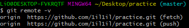
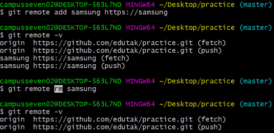
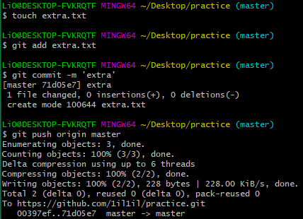
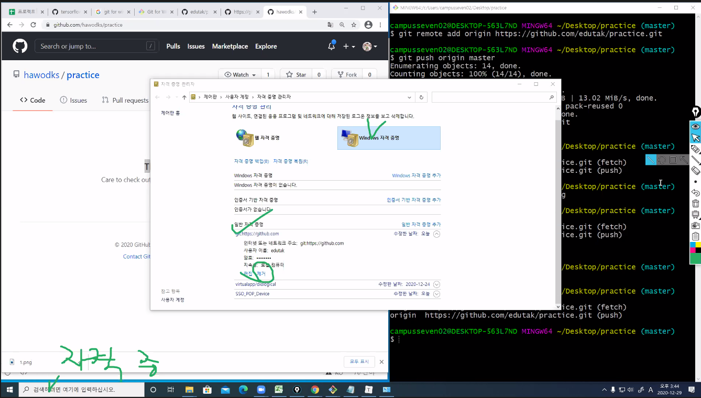
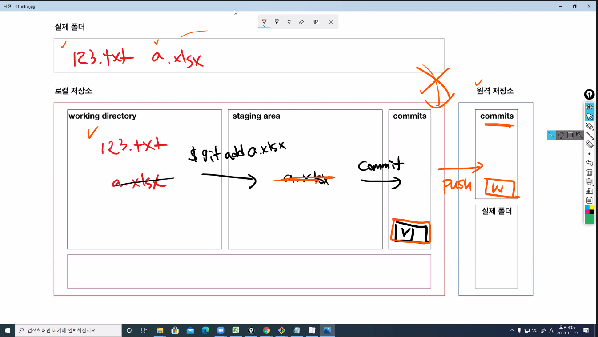
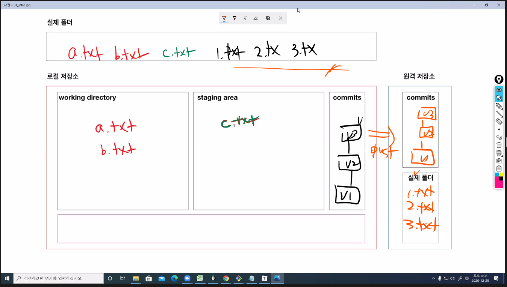
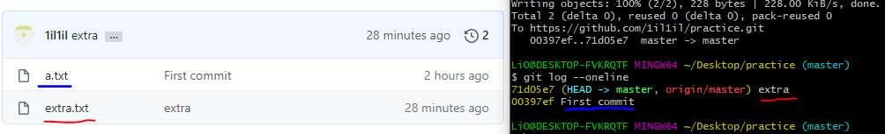

# 원격저장소(remote repository) 활용 기초

> 다양한 원격저장소 서비스 중에 Github를 기준으로 설명

# 준비사항

- Github에 비어있는 저장소( repository)를 만든다.

## 기초 명령어

### 1. 원격 저장소 설정

```bash
$ git remote add origin __url__
```

- 깃, 원격저장소를(remote), 추가해줘(add), origin이라는 이름으로 URL!
- 설정된 원격저장소를 확인하기 위해서는 아래의 명령어를 입력한다

```bash
$ git remote -v 
origin  https://github.com/1il1il/practice.git (fetch)
origin  https://github.com/1il1il/practice.git (push)
```



- 새로 원격저장소 만들고 지우기




### 2. PUSH

```bash
$ git push origin master
```

- origin 원격저장소의 master 브런치로 push



- 만약 PUSH가 안되는 경우

자격 증명 관리자에서 git 을 지우고 다시시도 (ID, PW가 틀린 경우)



- PUSH 되는 과정 설명



PUSH는 커밋을 원격 저장소에 올리는 것이고, 실제 폴더를 올리는 것이 아니다.

그렇기 때문에 커밋된 것만 원격 저장소에서 확인할 수 있다



커밋만 올라가므로 v1,v2,v3에 담긴 1,2,3.txt만 원격 저장소에서 확인할 수있다

### 3.  커밋 이력 확인

```bash
$ git log --oneline
```



`bash`에서 확인할 수 있고 원격 저장소에서도 이력을 확인할 수 있다

- 커밋 메시지를 잘 작성하기 위한 방법

> 좋은 git 커밋 메시지를 작성하기 위한 7가지 약속: [LINK](https://meetup.toast.com/posts/106)

- 커밋 메시지를 위한 영어 사전

> 좋은 git commit 메시지를 위한 영어 사전: [LINK](https://blog.ull.im/engineering/2019/03/10/logs-on-git.html)


