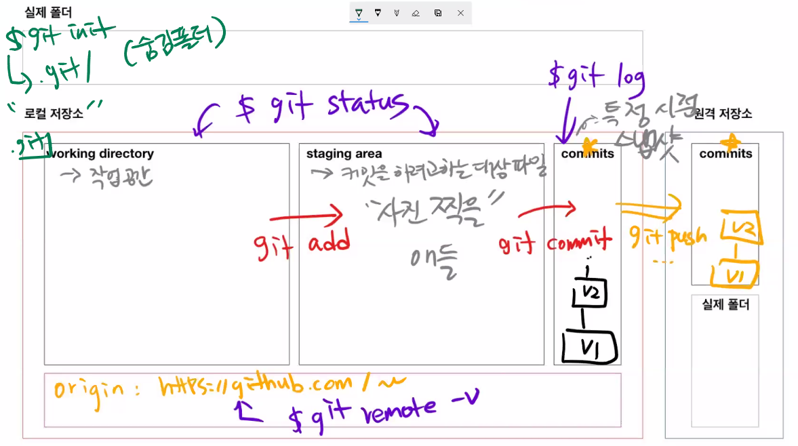
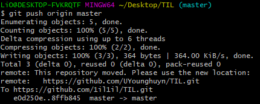
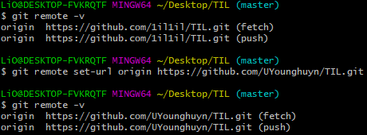

# 원격저장소(remote repository) 활용 기초

> 다양한 원격저장소 서비스 중에 Github를 기준으로 설명

## 1. 준비사항

- Github에 비어있는 저장소( repository)를 만든다.

---


## 2. 기초 명령어

### 1. 원격 저장소 설정

- 깃, 원격저장소를(remote), 추가해줘(add), origin이라는 이름으로 URL

```bash
$ git remote add origin __url__
```


- 설정된 원격저장소를 확인하기 위해서는 아래의 명령어를 입력한다

```bash
$ git remote -v 
origin  https://github.com/1il1il/practice.git (fetch)
origin  https://github.com/1il1il/practice.git (push)
```


- 새로 원격저장소 만들고 지우기


### 2. PUSH

- origin 원격저장소의 master 브런치로 push

```bash
$ git push origin master
```


- 만약 PUSH가 안되는 경우

자격 증명 관리자에서 git 을 지우고 다시시도 (ID, PW가 틀린 경우)


- PUSH 되는 과정 설명

PUSH는 커밋을 원격 저장소에 올리는 것이고, 실제 폴더를 올리는 것이 아니다.

그렇기 때문에 커밋된 것만 원격 저장소에서 확인할 수 있다


커밋만 올라가므로 v1,v2,v3에 담긴 1,2,3.txt만 원격 저장소에서 확인할 수있다


### 3.  커밋 이력 확인

- `log`를 통해 이력 확인할 수 있고 원격 저장소에서도 이력을 확인할 수 있다

```bash
$ git log --oneline
```


- 커밋 메시지를 잘 작성하기 위한 방법

> 좋은 git 커밋 메시지를 작성하기 위한 7가지 약속: [LINK](https://meetup.toast.com/posts/106)


- 커밋 메시지를 위한 영어 사전

> 좋은 git commit 메시지를 위한 영어 사전: [LINK](https://blog.ull.im/engineering/2019/03/10/logs-on-git.html)


### 4. 한눈에 확인하기

- `git init`으로 모든 변경 정보가 저장될 .git 폴더 생성
- `git status`로 현재 상태 확인
- `git add`로 커밋하고자 하는 대상 선정
- `git commit`으로 선정한 대상 커밋(특정 시점 스냅샷 저장)
- `git log`를 이용하여 `commit` 이력 확인 
- `git push origin master`를 이용하여 커밋을 원격 저장소에 전송
- `git remote -v`로 현재 연결된 원격 저장소 확인

---


## 3. 기타

### 1. 원격 저장소 주소 변경

- 예전에 만들어둔 github 계정의 이름을 대충 설정하여 변경함

 계정이름 변경후 기존 주소로  `push`를 시도하면 변경된 주소로 리다이렉트 된다

```bash
$ git push origin master
Enumerating objects: 5, done.
Counting objects: 100% (5/5), done.
Delta compression using up to 6 threads
Compressing objects: 100% (2/2), done.
Writing objects: 100% (3/3), 364 bytes | 364.00 KiB/s, done.
Total 3 (delta 0), reused 0 (delta 0), pack-reused 0
remote: This repository moved. Please use the new location:
remote:   https://github.com/UYounghuyn/TIL.git
To https://github.com/1il1il/TIL.git
   e0d250e..8ffb845  master -> master

```




하지만 항상 결과창에 리다이렉트됬다고 나올것 같아 연결된 주소를 변경해줌

```bash

$ git remote -v
origin  https://github.com/1il1il/TIL.git (fetch)
origin  https://github.com/1il1il/TIL.git (push)

$ git remote set-url origin https://github.com/UYounghuyn/TIL.git

$ git remote -v
origin  https://github.com/UYounghuyn/TIL.git (fetch)
origin  https://github.com/UYounghuyn/TIL.git (push)

```



~~영어 스펠링 틀려서  https://github.com/UYounghyun/TIL.git 으로 다시 한번 바꿈~~


- 변경하는 다른 방법

원격 저장소를 지우고 다시 잡아도 된다

```bash
$ git remote rm origin
```
