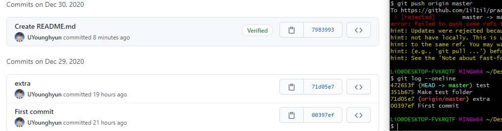
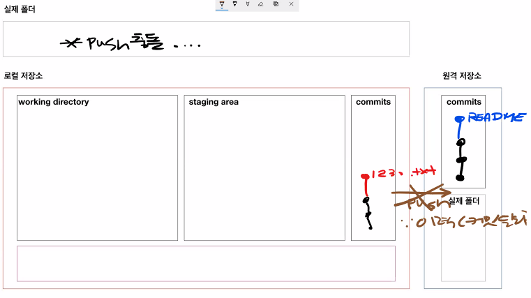
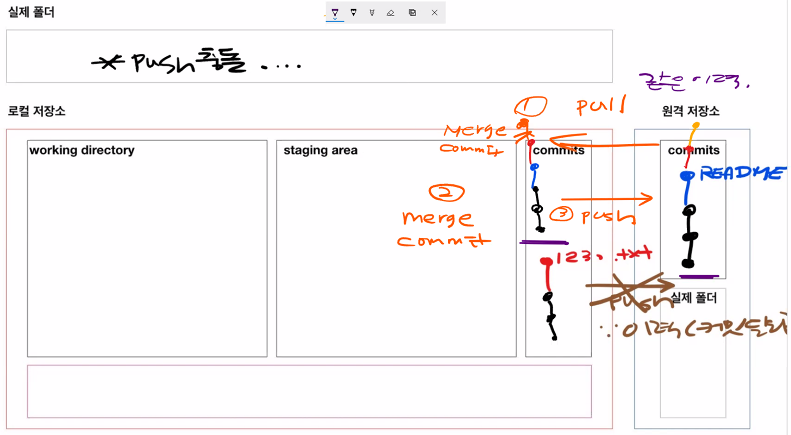

# PUSH 충돌 상황

- 문제상황

```bash
$ git push origin master
To https://github.com/1il1il/practice.git
 ! [rejected]        master -> master (fetch first)
error: failed to push some refs to 'https://github.com/1il1il/practice.git'
hint: Updates were rejected because the remote contains work that you do
hint: not have locally. This is usually caused by another repository pushing
hint: to the same ref. You may want to first integrate the remote changes
hint: (e.g., 'git pull ...') before pushing again.
hint: See the 'Note about fast-forwards' in 'git push --help' for details
```



원격 저장소와 로컬 저장소의 로그가 다름



- 해결하기

```bash
# 1. pull
# 원격 저장소의 변경사항을 받아오고
$ git pull origin master
remote: Enumerating objects: 7, done.
remote: Counting objects: 100% (7/7), done.
remote: Compressing objects: 100% (4/4), done.
remote: Total 6 (delta 2), reused 0 (delta 0), pack-reused 0
Unpacking objects: 100% (6/6), 1.33 KiB | 43.00 KiB/s, done.
From https://github.com/edutak/practice
 * branch            master     -> FETCH_HEAD
   1ce8a44..7822758  master     -> origin/master
Merge made by the 'recursive' strategy.
 README.md | 4 ++++
 1 file changed, 4 insertions(+)
 create mode 100644 README.md

# 2. 다시 push
$ git push origin master
Enumerating objects: 6, done.
Counting objects: 100% (6/6), done.
Delta compression using up to 8 threads
Compressing objects: 100% (4/4), done.
Writing objects: 100% (4/4), 499 bytes | 499.00 KiB/s, done.
Total 4 (delta 2), reused 0 (delta 0), pack-reused 0
remote: Resolving deltas: 100% (2/2), completed with 1 local object.
To https://github.com/edutak/practice.git
   7822758..3bb716a  master -> master
```

```bash
$ git log --oneline
# merge commit 발생!
3bb716a (HEAD -> master, origin/master) Merge branch 'master' of https://github.com/edutak/practice
7822758 Update README.md
d8f1ae3 hi
e94b045 Create README.md
1ce8a44 A
3566a2b 추가작업!!
08c9f10 hi
16915c2 파워포인트
b844872 보고서
f64d131 Init
4d9c1cc First commit
```



먼저 원격 저장소의 내용을 `pull`을 이용하여 가져온뒤 로컬 저장소의 커밋과 병합하여 로컬과 원격의 커밋을 일치 시킨다. 이후 로컬의 커밋을 다시 원격으로 `push`해야 한다.

- `push` 는 로컬의 내용을 원격으로 업로드`pull`은 원격의 내용을 로컬로 다운로드

따라서 다른 사람과 협업하는 경우 이러한 충돌이 빈번하게 일어날 수있다. 먼저 `pull`을 통해 커밋을 동기화하고 작업을 시작하자