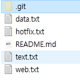

### 상황 1. fast-foward(혼자 다하기)

> fast-foward는 feature 브랜치 생성된 이후 master 브랜치에 변경 사항이 없는 상황

1. feature/test branch 생성 및 이동

   ```bash
   $ git branch feature/test
   
   $ git branch
     feature/test
   * master
   
   $ git checkout feature/test
   Switched to branch 'feature/test'
   
   LiO@DESKTOP-FVKRQTF MINGW64 ~/Desktop/branch (feature/test)
   ```

   

2. 작업 완료 후 commit

   ```bash
   $ touch text.txt
   
   $ git add .
   
   $ git commit -m 'Test'
   [feature/test f3fbd1a] Test
    1 file changed, 0 insertions(+), 0 deletions(-)
    create mode 100644 text.txt
   
   $ git log --oneline
   # feature/test 브랜치 + HEAD
   f3fbd1a (HEAD -> feature/test) Test
   # master 브랜치
   e157ba9 (master) Make README.md
   ```
   
   


3. master 이동

   ```bash
   $ git checkout master
   Switched to branch 'master'
   
   $ git log --oneline
   e157ba9 (HEAD -> master) Make README.md
   ```
   
   


4. master에 병합

   ```bash
   $ git merge feature/test
   Updating e157ba9..f3fbd1a
   # Master에 변경사항 없어서 그대로 덮어쓰기
   Fast-forward
    text.txt | 0
    1 file changed, 0 insertions(+), 0 deletions(-)
    create mode 100644 text.txt
   ```
   
   


5. 결과 -> fast-foward (단순히 HEAD를 이동)

   ```bash
   $ git log --oneline
   f3fbd1a (HEAD -> master, feature/test) Test
   e157ba9 Make README.md
   ```

   

6. branch 삭제

   ```bash
   $ git branch -d feature/test
   Deleted branch feature/test (was f3fbd1a).
   
   $ git log --oneline
   f3fbd1a (HEAD -> master) Test
   e157ba9 Make README.md
   ```
   
   

---

### 상황 2. merge commit(보고서/PPT 따로 제작)

> 서로 다른 이력(commit)을 병합(merge)하는 과정에서 다른 파일이 수정되어 있는 상황
>
> git이 auto merging을 진행하고, commit이 발생된다.
>
> 

1. feature/data branch 생성 및 이동

   ```bash
   $ git checkout -b feature/data
   Switched to a new branch 'feature/data'
   ```

   

2. 작업 완료 후 commit

   ```bash
   $ touch data.txt
   
   $ git add .
   
   $ git commit -m 'Add data.txt'
   [feature/data 13d6fe0] Add data.txt
    1 file changed, 0 insertions(+), 0 deletions(-)
    create mode 100644 data.txt
    
    $ git log --oneline
   13d6fe0 (HEAD -> feature/data) Add data.txt
   f3fbd1a (master) Test
   e157ba9 Make README.md
   ```

   

3. master 이동

   ```bash
   $ git checkout master
   Switched to branch 'master'
   
   $ git log --oneline
   f3fbd1a (HEAD -> master) Test
   e157ba9 Make README.md
   ```

   

4. *master에 추가 commit 이 발생시키기!!*

   * **다른 파일을 수정 혹은 생성하세요!**

   ```bash
   $ touch hotfix.txt
   
   $ git add .
   
   $ git commit -m 'Hotfix'
   [master e65dd85] Hotfix
    1 file changed, 0 insertions(+), 0 deletions(-)
    create mode 100644 hotfix.txt
   
   $ git log --oneline
   e65dd85 (HEAD -> master) Hotfix
   f3fbd1a Test
   e157ba9 Make README.md
   ```

   

5. master에 병합

   ```bash
   $ git merge feature/data
   Merge made by the 'recursive' strategy.
    data.txt | 0
    1 file changed, 0 insertions(+), 0 deletions(-)
    create mode 100644 data.txt
   ```

   

6. 결과 -> 자동으로 *merge commit 발생*

   * vim 편집기 화면이 나타납니다.
   * 자동으로 작성된 커밋 메시지를 확인하고, `esc`를 누른 후 `:wq`를 입력하여 저장 및 종료를 합니다.
      * `w` : write
      * `q` : quit
   * 커밋이  확인 해봅시다.

   ```bash
   $ git log --oneline
   6b45b67 (HEAD -> master) Merge branch 'feature/data'
   e65dd85 Hotfix
   13d6fe0 (feature/data) Add data.txt
   f3fbd1a Test
   e157ba9 Make README.md
   ```

   

7. 그래프 확인하기

   ```bash
   $ git log --oneline --graph
   *   6b45b67 (HEAD -> master) Merge branch 'feature/data'
   |\
   | * 13d6fe0 (feature/data) Add data.txt
   * | e65dd85 Hotfix
   |/
   * f3fbd1a Test
   * e157ba9 Make README.md
   ```

   

   

8. branch 삭제

   ```bash
   $ git branch -d feature/data
   Deleted branch feature/data (was 13d6fe0).
   # 가지는 그대로 있지만 그걸 가르키던 브랜치를 지운것
   
   $ git log --oneline --graph
   *   6b45b67 (HEAD -> master) Merge branch 'feature/data'
   |\
   | * 13d6fe0 Add data.txt
   * | e65dd85 Hotfix
   |/
   * f3fbd1a Test
   * e157ba9 Make README.md
   ```

   

   

---

### 상황 3. merge commit 충돌(보고서/PPT 함께 제작)

> 서로 다른 이력(commit)을 병합(merge)하는 과정에서 동일 파일이 수정되어 있는 상황
>
> git이 auto merging을 하지 못하고, 해당 파일의 위치에 라벨링을 해준다.
>
> 원하는 형태의 코드로 직접 수정을 하고 merge commit을 발생 시켜야 한다.

1. feature/board branch 생성 및 이동

   ```bash
   $ git checkout -b feature/board
   Switched to a new branch 'feature/board'
   ```

   

2. 작업 완료 후 commit

   - README.md 파일 수정, web.txt 생성

   ```bash
   $ touch web.txt
   
   $ git status
   On branch feature/board
   Changes not staged for commit:
     (use "git add <file>..." to update what will be committed)
     (use "git restore <file>..." to discard changes in working directory)
           modified:   README.md
   
   Untracked files:
     (use "git add <file>..." to include in what will be committed)
           web.txt
   
   no changes added to commit (use "git add" and/or "git commit -a")
   
   $ git add .
   
   $ git commit -m 'Add web.txt and Modify README.md'
   [feature/board 0cb4b75] Add web.txt and Modify README.md
    2 files changed, 1 insertion(+)
    create mode 100644 web.txt
   ```

   


3. master 이동

   ```bash
   $ git checkout master
   Switched to branch 'master'
   ```
   
   


4. *master에 추가 commit 이 발생시키기!!*

   * README.md 수정

   ```bash
   $ git add .
   
   $ git commit -m 'Modify README.md'
   [master c15730d] Modify README.md
    1 file changed, 1 insertion(+)
   ```

   

5. master에 병합

   ```bash
   $ git merge feature/board
   # 자동 병합중에
   Auto-merging README.md
   # 병합 충돌발생 in README.md
   CONFLICT (content): Merge conflict in README.md
   Automatic merge failed; fix conflicts and then commit the result.
   
   LiO@DESKTOP-FVKRQTF MINGW64 ~/Desktop/branch (master|MERGING)
   ```
   
   


6. 결과 -> *merge conflict발생*

   ```bash
   $ git status
   On branch master
   You have unmerged paths.
     (fix conflicts and run "git commit")
     (use "git merge --abort" to abort the merge)
   
   Changes to be committed:
           new file:   web.txt
   
   Unmerged paths:
     (use "git add <file>..." to mark resolution)
           both modified:   README.md
   ```
   
   


7. 충돌 확인 및 해결

   - 충돌이 생긴 README.md 파일 확인

   ```bash
   <<<<<<< HEAD
   master
   # 현재 HEAD인 master에선 이렇게 작업됬고
   =======
   Read
   >>>>>>> feature/board
   # feature/board 브랜치에선 이렇게 작업되었다
   ```

   


8. merge commit 진행

    ```bash
    # 수정후 add
    $ git add .
$ git commit
   ```
   
   * vim 편집기 화면이 나타납니다.
   
   * 자동으로 작성된 커밋 메시지를 확인하고, `esc`를 누른 후 `:wq`를 입력하여 저장 및 종료를 합니다.
      * `w` : write
      * `q` : quit
      
   * 커밋결과를  확인 해봅시다.
   
      ```bash
      $ git commit
      [master a648043] Merge branch 'feature/board'
      ```
   
      
   
9. 그래프 확인하기

    ```bash
   $ git log --oneline --graph
   *   a648043 (HEAD -> master) Merge branch 'feature/board'
   |\
   | * 0cb4b75 (feature/board) Add web.txt and Modify README.md
   * | c15730d Modify README.md
   |/
   *   6b45b67 Merge branch 'feature/data'
   |\
   | * 13d6fe0 Add data.txt
   * | e65dd85 Hotfix
   |/
   * f3fbd1a Test
   * e157ba9 Make README.md
    ```
   
   


10. branch 삭제

    ```bash
    $ git branch -d feature/board
    Deleted branch feature/board (was 0cb4b75).
    ```
    
    


### 총정리

