# Web Programing

## 1. 개념

- Network : 서로다른 컴퓨터가 데이터를 주고 받을 수 있는 통로, 체계
- Internet : Network of Network, 물리적인 Framework(전세계적으로 구축된 network망)
  - HTTP - web service
  - SMTP - Email
  - FTP - FTP service

---

- Web Client Program 
  - Browser(Chrome)
  - 따로 구현할 수 있다
- Web Server Program 
  - Apache, IIS, Oracle Web Service
  - 따로 구현하지 않는다
  - 정적인 Contents를 Service
  - 동적인 Contents를 만들지 못함 
    - 동적 Contents : 서버에서 별도의 Web Program(Server-Side Web Application)을 실행시켜서 나온 결과
      - Server-Side Web Application : Python Framework - Django
    - Web Server에서 불가능하여 위임 - WAS
- WAS(Web Application Server)

___

- Library : 특정 기능을 수행하는 Code 묶음
- Framework : 
- Platform : 다른 Program을 실행시킬수 있는 환경, Program

---

- Request 흐름

  - Case 1 (Round Trip 방식)
    - 단점 : 데이터 전송량이 많다

  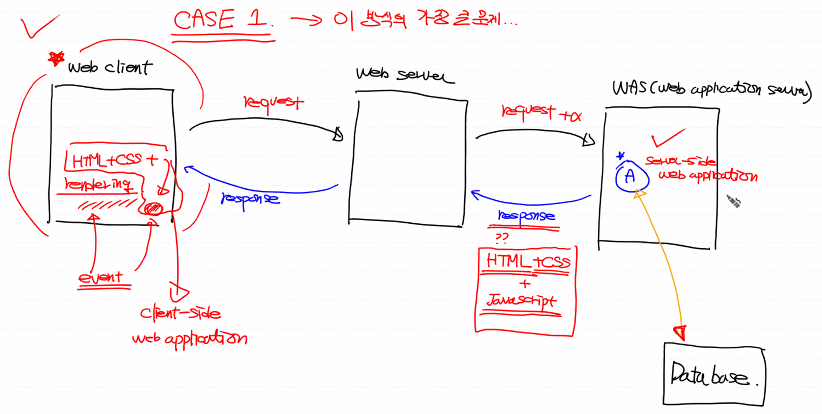

  - Case 2 (Client-Side Web Application 분리) (AJAX) - single page application

  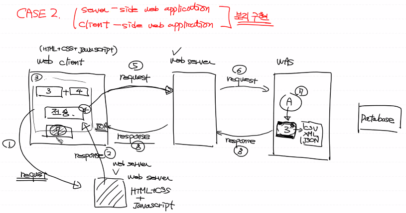

  - Case 2 실습

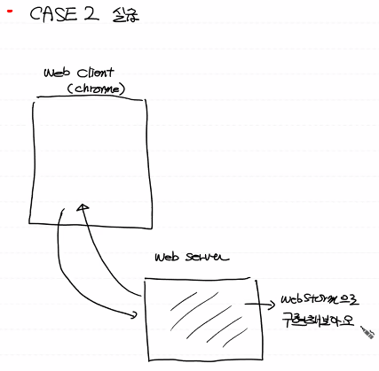

---


## 2. Client Web Application 작성

### 1. HTML 작성 기본

```html
<!DOCTYPE html>
<html lang="en">
<head>
    <meta charset="UTF-8">
    <title>Title</title>
    <script>
        function hello() {
    		alert('버튼이 클릭되었어요!')
		}
    </script>
</head>
<body>
일일 박스오피스 순위를 알아보아요!
<br><br>
key : <input type="text" id="userKey">
<br><br>
날짜 : <input type="text" id="userDate">
<br><br>
<input type="button" value="조회!" onclick="hello()">
</body>
</html>
```

- 입력 Box를 생성

  ```html
  key : <input type="text" id="userKey">
  <br><br>
  날짜 : <input type="text" id="userDate">
  ```
  
- 버튼 생성

  - `onclick()`은 버튼을 누를시 발생하는 이벤트

  ```html
  <input type="button" value="조회!" onclick="hello()">
  ```

  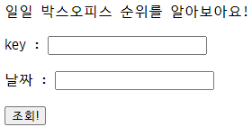

- 버튼 클릭시 이벤트 발생

  - Javascript로 함수 작성

  ```html
  <script>
      function hello() {
          alert('버튼이 클릭되었어요!')
      }
  </script>
  ```

  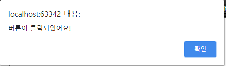

### 2. Javascript 분리

- 프로젝트 디렉토리 안에 Javascript위한 디렉토리 생성

  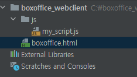

- Javascript파일을 생성하고 HTML에 작성한 Script를 옮겨준다

  ```javascript
  function hello() {
      alert('버튼이 클릭되었어요!')
  }
  ```

- HTML 변경

  - `scr`을 이용해 Javascript의 위치 지정
  
  ```html
  <!DOCTYPE html>
  <html lang="en">
  <head>
      <meta charset="UTF-8">
      <title>Title</title>
      <script src="js/my_script.js">
      </script>
  </head>
  <body>
  일일 박스오피스 순위를 알아보아요!
  <br><br>
  key : <input type="text" id="userKey">
  <br><br>
  날짜 : <input type="text" id="userDate">
  <br><br>
  <input type="button" value="조회!" onclick="hello()">
  </body>
  </html>
  ```

### 3. jQuery 사용

- jQuery를 이용하기 위해 CDN 방식을 사용

  - CDN(Contents Delivery Network) : 태그를 이용해서 라이브러리를 사용

- jQuery사이트 방문하여 다운로드 진행 [링크](https://jquery.com/)

  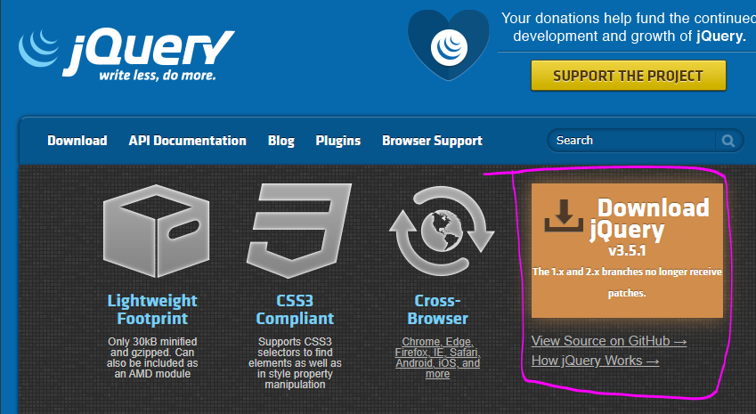

- 하단부의 CDN 방식으로 사용하기

  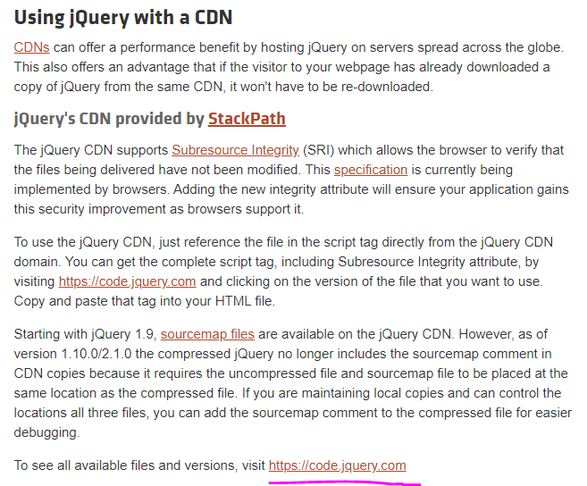

- 사용할 버전 확인

  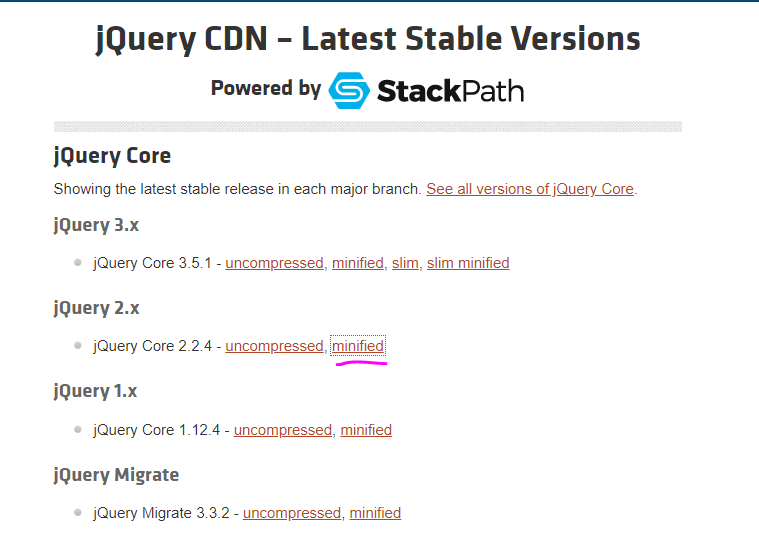

- 코드 복사해서 붙여넣기

  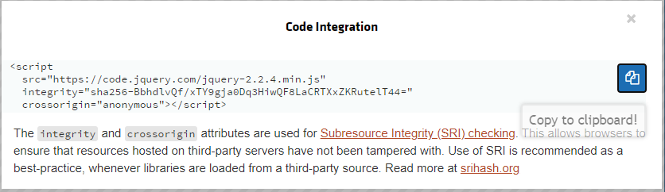

  ```html
  <!DOCTYPE html>
  <html lang="en">
  <head>
      <meta charset="UTF-8">
      <title>Title</title>
      <script src="https://code.jquery.com/jquery-2.2.4.min.js"
              integrity="sha256-BbhdlvQf/xTY9gja0Dq3HiwQF8LaCRTXxZKRutelT44="
              crossorigin="anonymous"></script>
      <script src="js/my_script.js">
      </script>
  </head>
  <body>
  일일 박스오피스 순위를 알아보아요!
  <br><br>
  key : <input type="text" id="userKey">
  <br><br>
  날짜 : <input type="text" id="userDate">
  <br><br>
  <input type="button" value="조회!" onclick="hello()">
  </body>
  </html>
  ```

- Javascript 수정

  - `$()`는 jQuery를 사용하기 위한 코드
  - `#`을 이용해서 HTML의 Id를 이용하여 접근
  - `val()`을 이용하여 해당 Id에 있는 값 접근
  - `location` : 현재 창을 의미
  - `.href` : url 바꾸기

  ```javascript
  function hello() {
      alert('버튼이 클릭되었어요!')
      user_key = $('#userKey').val()
      // c802b4cefc5c250d9013ca769e658871
      user_date = $('#userDate').val()
      open_api = 'http://www.kobis.or.kr/kobisopenapi/webservice/rest/boxoffice/searchDailyBoxOfficeList.json'
      my_url = open_api + '?key=' + user_key + '&targerDt=' + user_date
      location.href = my_url
  }
  ```

  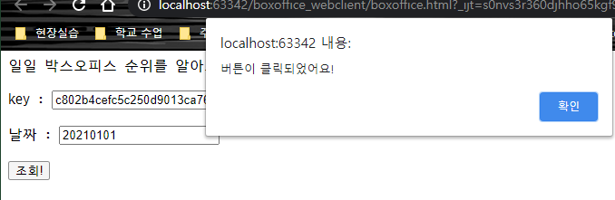

  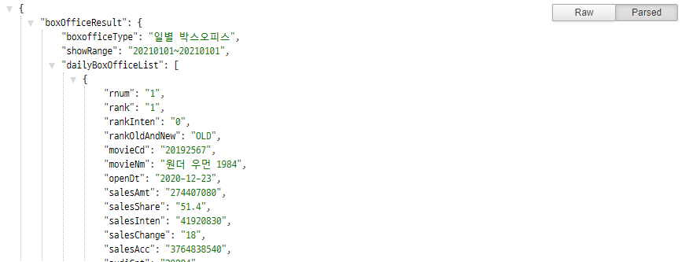

- 지금까지 작성한 코드가 바로 Client Web Application
  - jQuery의 장점은 사용하기 간단하다
  - 단점으로 유지보수엔 적절하지 않다.
    - 패턴에 맞춰 하는게 유지보수가 편하다(Anqular, React, Vue.js)

---


## 3. HTML & jQuery

### 1. HTML 

- element : HTML의 구성 요소 (<></>)
  - element의 종류는 크게 두가지로 구분
    - block level element : element가 한 라인을 완전히 차지
    - inline element : element가 해당 내용의 영역만 차지
- tag : <>로 구성되는 HTML 요소
- 기본적인 element

    - `<h1></h1>` : h1은 markdown의 #와 비슷

      ```Html
      <h1>여기는 h1입니다</h1>
      ```

    - `<ul></ul>` : unordered list

      ```html
      <ul> 
          <li>서울</li>
          <li>인천</li>
          <li>부산</li>
      </ul>
      ```

      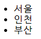

    - `<ol></ol>` : ordered list

      ```HTML
      <ol>
          <li>김연아</li>
          <li>홍길동</li>
          <li>아이유</li>
      </ol>
      ```

      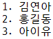

    - `<div></div>` : 영역구분 element

      - block level element로 한 라인을 전부 차지한다

    - `<span></span>` : 영역구분 element

      - inline element로 해당 내용의 영역만 차지

    - `` : 이미지를 표시하는 element , 끝나는 태그가 없다
    - `<input>` : 입력데이터를 받는 element, 끝나는 태그가 없다

### 2. jQuery

- selector : HTML element를 지칭하는 특수한 표기법을 의미

  1. 전체 선택자 : *

     - HTML의 모든 element를 찾아서 색상을 빨간색으로 변경

     ```javascript
     $('*').css('color','red')
     ```

  2. tag 선택자 : HTML의 tag를 이용하여 선택

     - `<span></span>`의 모든 내용을 지우기

     ```javascript
     $('span').remove()
     ```

  3. Id 선택자 :  Id를 이용하여 선택 (Id 값은 유일하다) 

     - Id가 `inchon`인 element를 선택하여 내용을 변경

     ```javascript
     $('#inchon').text('소리없는 아우성!')
     ```

  4. class 선택자 : class를 이용하여 선택 (Id와 유사하지만 class는 유일하지 않다)

     - `region`클래스의 element의 색상을 파란색으로 변경

     ```javascript
     $('.region').css('color','blue')
     ```

  5. 구조 선택자 : 부모, 자식, 형제 관계를 이용해서 선택

     - `ol`의 자식(`>`)인 `li` element를 선택하여 색상을 빨간색으로 변경

     ```javascript
     $('ol > li').css('color','red')
     ```

     