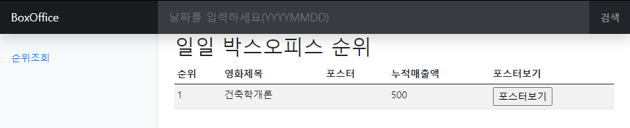
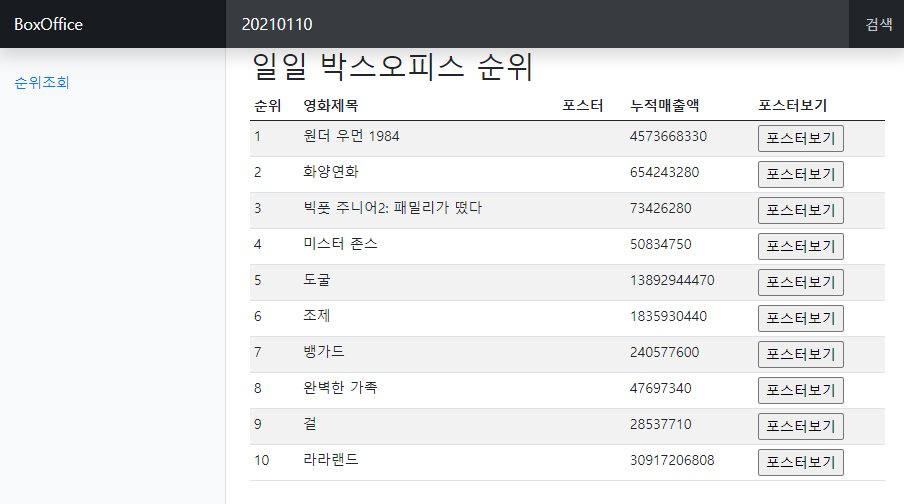
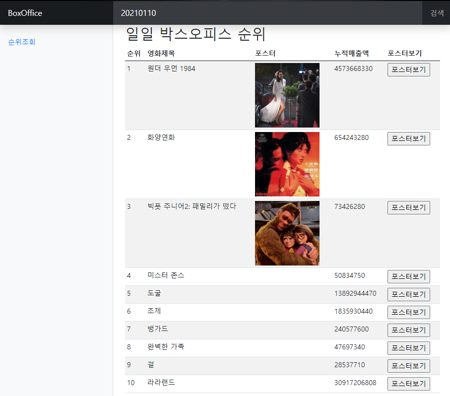

# Web Programing 실습

- 화면에 일일 박스오피스 순위 출력하고 포스터를 확인하기

    ```javascript
    function my_func() {
        let user_date = $('#userInputDate').val()
        let user_key = 'c802b4cefc5c250d9013ca769e658871'
        let open_api = 'http://www.kobis.or.kr/kobisopenapi/webservice/rest/boxoffice/searchDailyBoxOfficeList.json'
    
        $.ajax({
            url : open_api, // 호출할 서버쪽 프로그램의 url
            type : 'GET', // 서버쪽 프로그램에 대한 request 방식
            dataType : 'json', // 서버프로그램이 결과로 보내주는 데이터의 형식
            data : {
                key : user_key,
                targetDt : user_date
            }, // 서버 프로그램을 호출할때 전달되야하는 정보
            success : function (result) {
                $('#my_tbody').empty()
                let movie_list = result['boxOfficeResult']['dailyBoxOfficeList']
    
                for (let i=0; i<movie_list.length; i++) {
                    let m_lank = movie_list[i].rank
                    let m_name = movie_list[i].movieNm
                    let m_sales = movie_list[i].salesAcc
                    let tr = $('<tr></tr>')
                    let rank_td = $('<td></td>').text(m_lank)
                    let title_td = $('<td></td>').text(m_name)
                    let img_td = $('<td class="m_post"></td>')
                    let sales_td = $('<td></td>').text(m_sales)
                    let post_td = $('<td></td>')
                    let post_btn = $('<input />').attr('type','button')
                        .attr('value','포스터보기').attr('id', m_lank)
    
                    post_btn.on('click',function () {
                        let keyword = m_name
                        let img_tag = $('')
    
                        $.ajax({
                            url : 'https://dapi.kakao.com/v2/search/image',
                            type : 'GET',
                            dataType : 'json',
                            data : {
                                query :keyword
                            },
                            headers : {
                                Authorization : 'KakaoAK c1c91e71e21bbee8cdc83ab7f30cbc51'
                            },
                            success : function (img_result) {
                                let img_url = img_result['documents'][0]['thumbnail_url']
                                img_tag.attr('src', img_url)
                            },
                            error : function () {
                                alert('실패')
                            }
                        })
                        $(this).parent().parent().children('.m_post').append(img_tag)
                    })
    
                    tr.append(rank_td)
                    tr.append(title_td)
                    tr.append(img_td)
                    tr.append(sales_td)
                    post_td.append(post_btn)
                    tr.append(post_td)
                    $('#my_tbody').append(tr)
                }
            },
            error : function () {
                alert('뭔가 이상함')
            }
        })
    }
    ```


---


- jQuery로 AJAX 구현하기

   - jQuery를 이용하여 영화진흥위원회의 API를 사용하기

       - `$.ajax({})`안에 요소로 API를 이용한때 필요한 parameter를 넣으면 된다
       - API마다 요구하는 방식이 다르기 때문에 API마다 맞는 parameter를 찾아 넣어야 한다
   
       ```javascript
       $.ajax({
               url : open_api, // 호출할 서버쪽 프로그램의 url
               type : 'GET', // 서버쪽 프로그램에 대한 request 방식
               dataType : 'json', // 서버프로그램이 결과로 보내주는 데이터의 형식
               data : {
                   key : user_key,
	                targetDt : user_date
               },
           success : function() {
	    // 연결이 성공됬을때 실행
           },
           errors : function() {
       // 연결이 실패했을때 실행
           }
       })
       ```
   
   - 이때 `success : function() {}`가 실행될때 받은 결과를 `function()`의 첫번째 인자로 API의 결과를 받아온다. 이때 jQuery가 받아온 json을 Javascript의 객체로 만들어 반환한다.
   
   - 받아온 결과를 이용해서 표에 정보를 표현
   
     ```javascript
     success : function (result) {
         $('#my_tbody').empty() // 기존의 표를 초기화
         let movie_list = result['boxOfficeResult']['dailyBoxOfficeList'] // 일일 박스오피스 순위 리스트
         for (let i=0; i<movie_list.length; i++) {
             let m_lank = movie_list[i].rank
             let m_name = movie_list[i].movieNm
             let m_sales = movie_list[i].salesAcc
             let tr = $('<tr></tr>')
             let rank_td = $('<td></td>').text(m_lank) // 순위
             let title_td = $('<td></td>').text(m_name) // 제목
             let img_td = $('<td class="m_post"></td>') // 포스터
             let sales_td = $('<td></td>').text(m_sales) // 누적 매출
             let post_td = $('<td></td>') // 포스터 확인칸
             let post_btn = $('<input />').attr('type','button')
                 .attr('value','포스터보기').attr('id', m_lank)
             // 포스터 확인 버튼
     
             post_btn.on('click',function () {
                 let keyword = m_name
                 let img_tag = $('')
     
                 $.ajax({
                     url : 'https://dapi.kakao.com/v2/search/image',
                     type : 'GET',
                     dataType : 'json',
                     data : {
                         query :keyword
                     },
                     headers : {
                         Authorization : 'KakaoAK c1c91e71e21bbee8cdc83ab7f30cbc51'
                     },
                     success : function (img_result) {
                         let img_url = img_result['documents'][0]['thumbnail_url']
                         img_tag.attr('src', img_url)
                     },
                     error : function () {
                         alert('실패')
                     }
                 })
                 $(this).parent().parent().children('.m_post').append(img_tag)
             })
     
             tr.append(rank_td)
             tr.append(title_td)
             tr.append(img_td)
             tr.append(sales_td)
             post_td.append(post_btn)
             tr.append(post_td)
             $('#my_tbody').append(tr)
         }
     }
     ```
   
   - 이때 해당 영화의 포스터를 찾아오기 위해 Kakao의 검색 API를 이용한다 
   
     ```javascript
     post_btn.on('click',function () {
         let keyword = m_name
         let img_tag = $('')
     
         $.ajax({
             url : 'https://dapi.kakao.com/v2/search/image',
             type : 'GET',
             dataType : 'json',
             data : {
                 query :keyword
             },
             headers : {
                 Authorization : 'KakaoAK c1c91e71e21bbee8cdc83ab7f30cbc51'
             },
             success : function (img_result) {
                 let img_url = img_result['documents'][0]['thumbnail_url']
                 img_tag.attr('src', img_url)
             },
             error : function () {
                 alert('실패')
             }
         })
         $(this).parent().parent().children('.m_post').append(img_tag)
     })
     ```
   
   - 영화의 제목을 이용하여 Kakao의 검색 API를 이용하여 이미지를 검색한뒤, 첫번째 검색결과의 썸네일을 가져온다 
   
   - 이때 `.parent()`와 `.children()`을 통해 특정 태그의 조상과 자손을 찾아갈 수 있다


---


- 결과

  - 첫 화면

      

      

  - 검색결과
  
    
    
    
  
  - 포스터 보기 결과
  
    