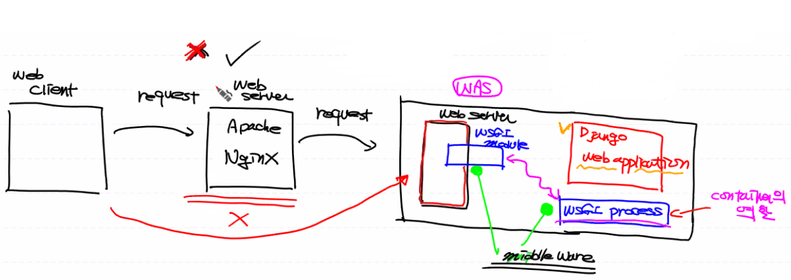
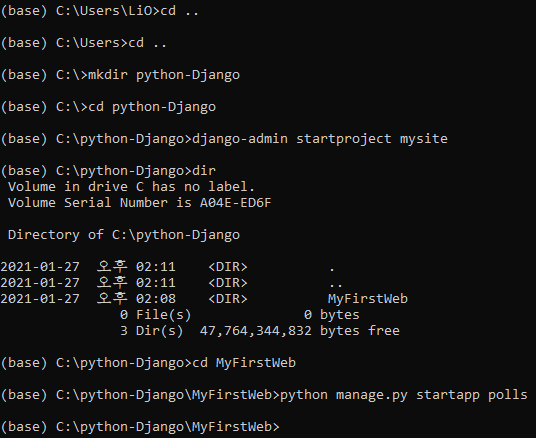
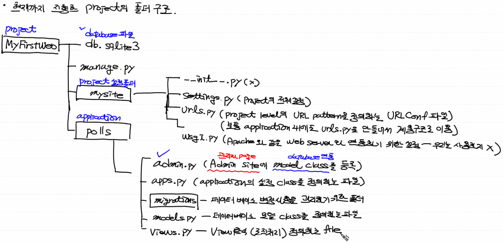

# Django
## 1. Django 설명

- web server : 인터넷을 통해 client의 request가 전달됬을때 이 요청을 처리하는 일반적인 하드웨어와 **소프트웨어**를 지칭
  
- 정적 resource를 서비스하는데 초점
  
- CGI(common gateway interface) : 웹 서버에서 application을 수행시키기 위한 규약

  - 정적인 기능을 하는 웹 서버의 동적인 프로그램을 수행시킬수 있는 기능을 부여
  - (C, perl등 이용)  클라이언트의 리퀘스트 -> 웹 서버(Apache, Nginx) -> 프로그램 실행 (웹 서버가 직접)
  - 웹 서버에 과부하가 심하다

- WAS(web application server) : 일반적으로 web server와 web application을 동작시킬수 있는 container를 분리

  - 일반적으로 프로그램이며, 몇개의 프로그램의 집합이며, 해당 프로그램이 돌아가는 컴퓨터를 의미한다

  

  - 클라이언트의 리퀘스트 - 웹서버(Apache, Nginx) - was(Tomcat, jBOss) - 프로그램 실행

- WSGI(web server gateway interface) : 파이썬에 종속된 개념

  - 파이썬으로 파이선 스크립트(web application)가 웹 서버와 통신하기위한 규약
  - 클라이언트 리퀘스트 - 웹 서버 - wsgi server(middleware) - wsgi 규약을 준수하는 웹 어플리케이션(Django로 작성)을 실행

  

- Django : 파이선으로 만들어진 무료로 사용할 수 있는(open souce) web application framework

  

- 장고의 특징 

  - MVT 패턴을 이용 : 디자인 패턴(MVC 패턴 - 프로그램 전체 구조에 대한 패턴)

    - MVC 

      - M - model : data - database의 데이터 핸들링

      - V - view : UI

      - C - controller : Business logic

        

    - MVT

      - Model (model)
      - View (logic)
      - Template (ui)

  - ORM(object relational mapping)

    - 파이선의 (클래스, 오브젝트)를 이용해서 database를 제어(내부적으로 SQL을 자동생성하여 사용) 

  - 관리자 페이지가 자동으로 생성

  - elegant url (우아한 url) - 일반적으로 web program할때 url design을 해야함. 이를 직관적이고 쉽게 표현 가능

---

- 용어정리

  - 일반적으로 server - side web application
    - project : 우리가 개발하는 전체 프로그램(우리가 구현하는 site)
    - application : 우리 project내에서 module화된 단위 program

- MVT 패턴

  

- Project 설계 (설문조사 web program)

  1. 화면 UI 설계

  	

  2. Database Table 설계

     1. Question table : 질문내용을 담는 table
      - column
          - id (int, AI, PK, not null)
          - question - text (문자열, not null)
          - pub - date (날짜, not null)
  
     2. choice table
        - column
          - id
          - choice - text
          - votes (투표수) - (숫자)
          - question_id (FK)

---

## 2. Django 실습

- Django를 이용하여 프로젝트 생성

  

  

- pycharm을 이용해 만들어둔 프로젝트를 불러오기

  - pycharm을 이용해 db.sqlite3 파일 생성
      - admin site 때문에 DB가 있어야 동작가능
      - 콘솔에서 `python manage.py migrate`을 입력

  - pycharm을 이용해 만들어둔 프로젝트를 불러오기
      - `python manage.py runserver`로 동작확인

- `localhost:8000`으로 접속하여 확인

