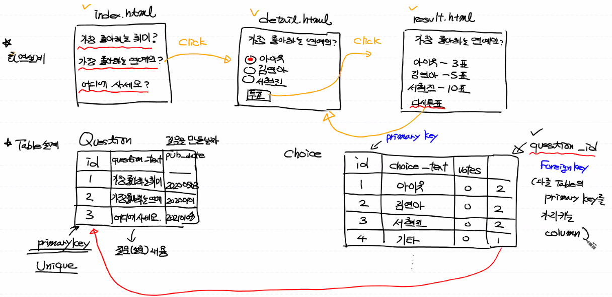

# Django 실습

- project 설계

  

  

- localhost:8000/admin

  

  

- CMD에서 `python manage.py createsuperuser`로 관리자 계정 생성

  

  

  

- 모델 작업 : Database의 Table을 만들기 

  - Django에선 Class로 구현됨

  - polls/models.py가 우리가 제작할 application의 Class가 들어갈 파일

  - 이 안에 Question, Choice를 제작

    ```python
    from django.db import models
    
    
    # Create your models here.
    class Question(models.Model):
        # 이렇게 정의되는 클래스가 DB의 Table과 맵핑됨
        # Table의 column은 속성으로 표현
        # models.CharField(max_length=200) = 문자열이고 최대길이 200자 제한
        question_text = models.CharField(max_length=200)
        # ('코멘트')로 해당 column에 대한 설명 가능
        pub_date = models.DateTimeField('data published')
    
        def __str__(self):
            # 이게 있어야 질문을 제대로 출력할 수 있음
            # 없으면 메모리 주소를 출력함
            return self.question_text
    
    
    class Choice(models.Model):
        choice_text = models.CharField(max_length=200)
        # IntegerField(default=0) - 정수형 데이터이며 초기값은 0
        votes = models.IntegerField(default=0)
        # 나중에 다른 Table의 PK를 가르킴
        # FK는 접미사로_id가 붙음 question_id로 됨
        # FK설정을 위해 ForeignKey(Question)으로 어디의 PK인지 명시
        # FK의 제약사항 - PK 지우고 싶으면 해당 PK를 FK로 갖는 모든 값을 지우고나서 삭제 가능
        # , on_delete=models.CASCADE를 통해 무결성확보 - PK 지워질때 함께 지워짐
        question = models.ForeignKey(Question, on_delete=models.CASCADE)
    
        def __str__(self):
            return self.choice_text
    ```

    

- 정의한 Class를 admin.py에 기록

  ```python
  from django.contrib import admin
  from polls.models import Question, Choice
  # 내가 만든 클래스를 사용하기 위해 import해야함
  
  # Register your models here.
  admin.site.register(Question)
  admin.site.register(Choice)
  ```

  

- 변경사항을 파일로 기록

  


- 변경사항을 바탕으로 DB 작성

  


- 테이블 확인

  


- 만들어진 Table 확인

  [DB Browser for SQLite](https://sqlitebrowser.org/blog/version-3-12-1-released/)에서 프로그램 다운

  


- DB Browser for SQLite.exe로 DB확인

  


- 이후 작업 흐름

  


- URLCONF 추가 (mysite.urls.py 파일이 기본 root URLCONF)

  ```python
  from django.contrib import admin
  from django.urls import path
  from polls import views
  
  # http://locallhost:8000/이 기본
  # (특정 경로, 내가 호출할 view함수(views.py에 있음))
  # views.index()은 함수 호출
  
  urlpatterns = [
      path('admin/', admin.site.urls),
      # name는 나중에 템플릿에서 나옴
      path('polls/', views.index, name='index')
  ]
  ```

  

- views.py

  - Django는 request가 들어왔을때 그 request의 정보를 모아 객체로 만들어줌
  - 그 request 객체는 view함수의 첫 인자(request)로 들어간다

  ```python
  from django.shortcuts import render
  from polls.models import Question
  
  # Create your views here.
  
  def index(request):
      # DB에서 설문목록을 가져오기, 이 목록은 우리가 models의 Question에 있음
      # 테이블명 : polls_question, 클래스명 : Question
      # 테이블안에 있는 모든 레코드를 가져오기
      # 이 레코드가 객체(objects)가 되어 넘어온다
      # .order_by('-pub_date') pub_date에 대한 내림차순 정렬 - 최근 날짜로 정렬
      # [:5] 그중 5개만 가져오기 - 결과가 리스트로 넘어옴
      question_list = Question.objects.all().order_by('-pub_date')[:5]
  ```


- 중간점검
  - `request + model data + index.html`이 우리가 만들 결과 
  - 지금 model data(view()를 이용해서 만든 데이터)까지 만듬


- view.py 이어서

  - 데이터 전달용 dict를 만들고(model data)
  - render() 함수를 이용하여 결과(request + model data + index.html)를 만든다

  ```python
  def index(request):
  	'''
  	생략
  	'''
      # 데이터 전달용 dict를 만들기 - model data(?)
      context = {'q_list': question_list}
      # render() : 결과 생성하는 함수
      return render(request, 'index.html', context)
  ```


- 템플릿 작성

  - 우리가 작성중인 polls아래 templates 디렉토리를 만들고 그 안에 위에 지정한 index.html 작성

  


- 질문 작성

  - admin에서 설문작성

  

  

  


- 선택지 작성

  

  


- view.html 작성

  -  : python 로직 표현
  - {{ 문자열로 표현되는 값 }} : 문자열 값

  ```HTML
  <!DOCTYPE html>
  <html lang="en">
  <head>
      <meta charset="UTF-8">
      <title>Title</title>
  </head>
  <body>
      
      <!-- 리스트 안에 데이터가 있으면 -->
          <ul>
              
                  <li>
                      <a href="/polls/{{ question.id }}">{{ question.question_text }}<a/>
                  </li>
              
          </ul>
      
      <!-- 리스트 안에 데이터가 없으면 -->
          <h1>데이터가 없습니다</h1>
  
      
  
  </body>
  </html>
  ```

---


- 여기까지 정리
  - Django로 프로젝트 만들기
  - App 만들기
  - setting.py 변경
  - 모델에서 테이블을 클래스로 만들기
  - 정의한 클래스 admin에 기입 (빠뜨림)
  - 만들걸로 DB 만들기
  - urlconf의 path에 내가 만든 polls를 등록
    - 여기서 views의 index()언급
  - views.py에 index()함수 작성
    - 여기서 Question의 설문 목록을 render()로 모아서 반환
  - templates라는 하위 디렉토리 생성, view.html 생성
  - view.html에서 index()가 리턴한 데이터 받아서 화면에 표현