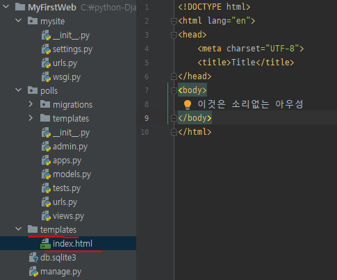
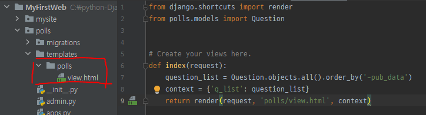
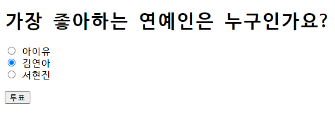
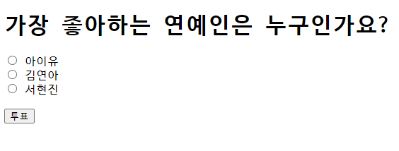
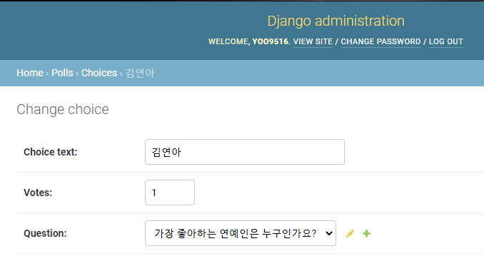
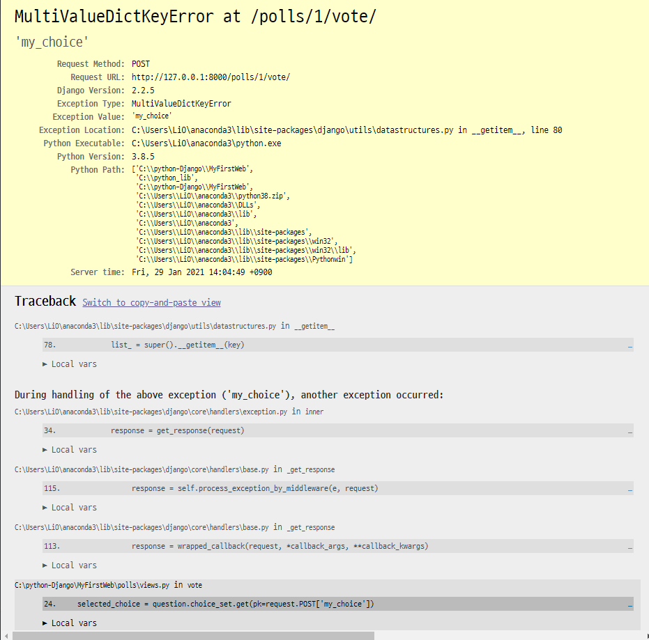
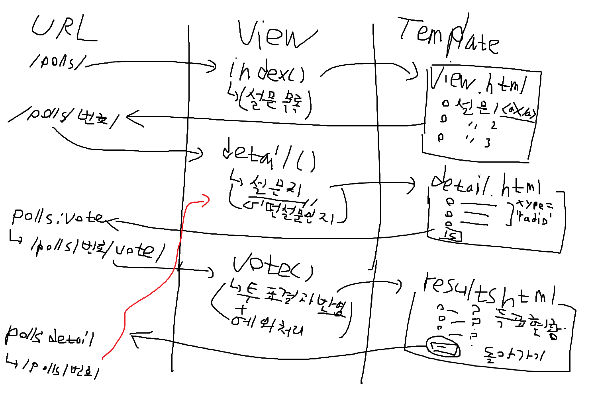

# Django 실습 이어서

- urls.py 분리

  - 루트의 urls.py에 모든 주소를 기입하는 것은 사실상 불가능

  - 그래서 어플리케이션마다 urls.py를 만들어 그걸 루트와 연결(include())

    ```python
    from django.contrib import admin
    from django.urls import path
    from django.urls import include
    
    urlpatterns = [
        path('admin/', admin.site.urls),
         # polls의 url에서 나눠서 url 맵핑 - 어플리케이션 마다 url 관리
        path('polls/', include('polls.urls'))
    ]
    ```

    ​	

  - polls.urls

    - 여기서 polls/로 들어온 모든 url을 처리
    - 이때 중복을 방지하기 위해서 `app_name`를 부여

    ```python
    from django.urls import path
    from . import views
    
    app_name = 'polls'
    
    # polls:index
    urlpatterns = [
        path('', views.index, name='view')
    ]
    ```

    

- setting 수정

  - 템플릿 부분에 추가

  ```python
  TEMPLATES = [
      {
          'BACKEND': 'django.template.backends.django.DjangoTemplates',
          # 경로 만들기, 템플릿을 찾을 경로 설정
          # 어플리케이션마다 별로도 만들어도 되고, 프로젝트마다 만들어도 된다
  		# 이번엔 프로젝트아래 템플릿 폴더 생성
          'DIRS': [os.path.join(BASE_DIR, 'templates')],
          'APP_DIRS': True,
          'OPTIONS': {
              'context_processors': [
                  'django.template.context_processors.debug',
                  'django.template.context_processors.request',
                  'django.contrib.auth.context_processors.auth',
                  'django.contrib.messages.context_processors.messages',
              ],
          },
      },
  ]
  ```

  

  - templates이 여러개면 먼저 최상위 부터 하나씩 확인

    

    

  - 이 상태에서 localhost:8000/polls에 접속하면 방금 만든 index.html을 불러옴

    - render()에서 view.html을 찾음 그래서 최상단 부터 찾으면서 내려옴

    ```python
    def index(request):
        question_list = Question.objects.all().order_by('-pub_data')
        context = {'q_list': question_list}
        return render(request, 'view.html', context)
    ```

  

  - polls아래의 templates 아래에 다시 새로운 폴더 생성하고 그 아래 view.thml 이동

    

    ```python
    def index(request):
        question_list = Question.objects.all().order_by('-pub_data')
        context = {'q_list': question_list}
        return render(request, 'polls/view.html', context)
    ```

    

- 설문 페이지 연결

  - polls아래 urls.py를 변경

    ```python
    from django.urls import path
    from . import views
    
    
    app_name = 'polls'
    
    # polls:index
    urlpatterns = [
        path('', views.index, name='view'),
        # <타입:전달될때 사용되는 이름> 변하는 값이 들어옴
        # <>의 기본은 문자열
        # detail 함수에 숫자가 넘어갈때 question_id이라는 이름으로 넘어감
        path('<int:question_id>/', views.detail, name='detail')
    ]
    ```

    

  - 이제 views.py에 detail()과 그 함수가 호출할 detail.html도 만들어야함

  

  - detail() 작성

    ```python
    from django.shortcuts import render, get_object_or_404
    from polls.models import Question
    
    
    def detail(request, question_id):
        # 숫자하나가 question_id로 들어옴 이 숫자는 설문에 대한 PK
        # Question에서 pk=question_id인 객체 하나 가져오거나 404 error
        question = get_object_or_404(Question, pk=question_id)
        context = {'selected_question': question}
        return render(request, 'polls/detail.html', context)
    ```

    

  - detail.html 작성

    - `selected_question.choice_set.all` : selected_question으로 넘겨준 데이터에서 choice 테이블의 집합(set)의 모든 것(all)을 가져오기
    - `forloop.counter` for의 loop별 숫자(?)
  
- `<form action='' type='post'>`에서 action에 넘어갈 url 기술
      -  : url인데 urls.py에서 지정한 name를 이용(polls:name) 즉  urls.py에서 지정한 `<int:question_id>/vote/`를 polls:name으로 가져오는 것. 이때 selected_question.id은` <int:question_id>`의 question_id에 들어갈 값
    - `<input type='submit'>` 버튼을 누르면 `<input name='' value=''>`의 name과 value 값이 넘어감. 그래서 vaule의 값을 `choice.id`로 지정
  
    ```HTML
    <!DOCTYPE html>
    <html lang="en">
    <head>
        <meta charset="UTF-8">
        <title>Title</title>
    </head>
    <body>
        <h1>{{ selected_question.question_text }}</h1>
        <!-- action='http://localhost:8000/polls/{selected_question.id}/vote' -->
        <form action="" method="POST">
        
            
                <input type="radio" name="my_choice"
                       id="kaka{{ forloop.counter }}"
                       value="{{ choice.id }}">
                <label for="kaka{{ forloop.counter }}">
                    {{ choice.choice_text }}
                </label><br>
        
            <br>
            <input type="submit" value="투표">
            <!-- 버튼을 누르면 name:value 형태로 값이 넘어감
                 그래서 value에 choice.id를 넣어 어떤걸 선택했는지 표시-->
        </form>
    </body>
    </html>
    ```
  
  
  
  
  - urls.py에 vote 추가
  
    ```python
    from django.urls import path
    from . import views
    
    
    app_name = 'polls'
    
    # polls:index
    urlpatterns = [
        path('', views.index, name='view'),
        # <> 변하는 값이 들어옴
        # polls:index = http://localhost:8000/polls
        path('<int:question_id>/', views.detail, name='detail'),
        # polls:vote = http://localhost:8000/polls/<int>/vote
        path('<int:question_id>/vote/', views.vote, name='vote')
    ]
    ```
  
  
  
  - vote() 추가
  
    ```python
    # 선택한 결과를 가져와 그 결과에 해당하는 DB의 Vote값을 증가시키기
    def vote(request, question_id):
        question = get_object_or_404(Question, pk=question_id)
        # 넘어오는 리퀘스트중에 POST 방식으로 넘어오고 name가 my_choice인 값을 pk로 사용
        selected_choice = question.choice_set.get(pk=request.POST['my_choice'])
    
        # 객체의 값 변경
        selected_choice.votes += 1
        # 변경된 객체값을 DB에 적용하기
        selected_choice.save()
    
        # 일단 확인용 > 투표화면 다시 나옴 : vote수가 올라가면 됨
        context = {'selected_question': question}
        return render(request, 'polls/detail.html', context)
    ```
  
  
  
- 지금까지 한거

  - 투표함

  

  

  - 투표 누르면 다시 돌아옴

  

  

  - admin에서 김연아 vote 확인

    

  - 만약 아무것도 선택하지 않았다면?

    

  

-  예외처리 추가

  - vote()에 예외처리 추가

      ```python
      from polls.models import Choice
      
      
      # 선택한 결과를 가져와 그 결과에 해당하는 DB의 Vote값을 증가시키기
      def vote(request, question_id):
          question = get_object_or_404(Question, pk=question_id)
    # 넘어오는 리퀘스트중에 POST 방식으로 넘어오고 name이 my_choice인 값을 pk로 사용
          try:
              selected_choice = question.choice_set.get(pk=request.POST['my_choice'])
      
          except(KeyError, Choice.DoesNotExist):
              # PK가 없어서 오류가 발생할 경우
              # 화면 출력용 선택 설문데이터와 함께 에러 메세지도 함께 넘김
        return render(request, 'polls/detail.html', {
                  'selected_question': question,
                  'error_message': '아무것도 선택하지 않았습니다.'
              })
      
          else:
        # 객체의 값 변경
              selected_choice.votes += 1
              # 변경된 객체값을 DB에 적용하기
              selected_choice.save()
      
            # 일단 확인용 > 투표 메인화면 다시 나옴 : vote수가 올라가면 됨
              context = {'selected_question': question}
            return render(request, 'polls/detail.html', context)
    ```

  
  
  - detail.thml 수정
  
    ```HTML
    <!DOCTYPE html>
    <html lang="en">
    <head>
        <meta charset="UTF-8">
        <title>Title</title>
    </head>
    <body>
        <h1>{{ selected_question.question_text }}</h1>
        <!-- 에러메세지가 넘어오면 아래의 태그 출력 
    		 개인적으론 이거 자바스크립트로 alert()출력도 괜찮을거 같음-->
        
        <div>{{ error_message }}</div>
        
    
        <!-- action='http://localhost:8000/polls/{selected_question.id}/vote' -->
        <form action="" method="POST">
        
            
                <input type="radio" name="my_choice"
                       id="kaka{{ forloop.counter }}"
                       value="{{ choice.id }}">
                <label for="kaka{{ forloop.counter }}">
                    {{ choice.choice_text }}
                </label><br>
            
            <br>
            <input type="submit" value="투표">
          <!-- 버튼을 누르면 name:value 형태로 값이 넘어감
                 그래서 value에 choice.id를 넣어 어떤걸 선택했는지 표시-->
      </form>
    </body>
  </html>
    ```
  
    
    
  
- 투표 이후 투표 현황 출력 페이지 출력

  - vote() 수정

    ```python
        else:
            # 객체의 값 변경
            selected_choice.votes += 1
            # 변경된 객체값을 DB에 적용하기
            selected_choice.save()
    
            # render()의 역할 HttpResponse()를 만들어줌
            # HttpResponseRedirect() : 클라이언트에게 url을 보내서 호출하게만듬
            # 그럼 클라이언트가 해당 URL을 다시 서버에 요청
            # reverse() : urls.py(urlconf)에 있는 name을 이용해서 url 형식으로 변환
            return HttpResponseRedirect(reverse('polls:results', args=(question_id, )))
    ```

    

  - urls.py에 추가

    ```python
    path('<int:question_id>/results/', views.results, name='results')
    ```

    

  - views.py에서 results() 추가

    - 선택한 설문의 choice 받기위해 선택한 설문 id 받아서 해당 설문객체를 전송

        ```python
        def results(request, question_id):
            question = get_object_or_404(Question, pk=question_id)
            return render(request, 'polls/results.html', {'question': question})
        ```

    

  - results.html 추가

    - `for`문으로 선택한 설문의 선택지와 그 선택지의 득표수를 차례로 `<li>`로 출력
    - `<a></a>`를 통해 다시 투표 화면으로 돌아갈 수 있게 설정
    
    ```HTML
    <!DOCTYPE html>
    <html lang="en">
    <head>
        <meta charset="UTF-8">
        <title>Title</title>
    </head>
    <body>
        <h1>{{ question.question_text }}</h1>
        <ul>
            
                <li>{{ choice.choice.text }} - {{ choice.votes }}</li>
            
        </ul>
        <a href="">다시 투표하기</a>
</body>
    </html>
    ```

    


- 정리

  

  

  1. 설문목록 출력
  
     1. urls.py에 설문목록이 출력될 주소(/polls/) 작성
        - 이때 출력될 주소와 주소의 name_space(`name=`) 그리고 실행될 index()도 지정
     2. 해당주소에서 실행될 index() 정의
        - 출력을 할 데이터(설문목록)와 출력이될 html(view.html), request를 render()로 묶어 보낸다
   3. 전달받은 데이터(설문목록)을 view.html에서 어떻게 화면이 출력할지 작성
        	- 설문목록에 해당 설문을 진행할 수 있는 url을 할당

   2. 설문진행 페이지
  
       1. 1-3에서 연결된 설문진행 url을 urls.py(/polls/설문번호)에 작성
          - 이때 출력될 주소와 주소의 name_space 그리고 실행될 detail()도 지정
      2. 해당주소에서 실행될 detail() 정의
         - 내가 선택한 설문의 번호인 id 값을 통해 어떤 설문을 선택했는지 정보가 넘어온다
         - 이를 바탕으로 사용자가 선택한 설문을 찾아 해당 설문이 가진 선택지와 선택지가 출력될 html(detail.html) rmflrh request를 render()로 보낸다
      3. 전달받은 데이터를 detail.html에서 어떻게 화면에 출력할지 작성
       - 선택지를 `<form></form>`안의 `<input type='radio'>`로 설정하여 하나만 선택할 수 있게 지정
         - 선택된 정보를 `POST`방식을 이용해서 `/polls/번호/vote/`로 보냄

  3. 선택한 정보를 DB에 반영

     1. 2-3에서 받은 데이터를 처리할 url(`/polls/번호/vote/`)을 urls.py에 작성

        - 이때 실행될 vote() 지정

     2. 해당 주소에서 실행될 vote() 정의
  
        - 우선 사용자가 선택한 설문과 선택지를 받아오고 이를 이용하여 DB에 접근하여 해당 선택지의 votes 속성을 변화시킴
        - 만약 선택을 안했을시를 위해 예외 처리
      - 정상적인 경우 선택후 result.html로 넘어가도록 지정
          - 이를 위해 urls.py에 results에 대한 url(`/polls/번호/results`) 추가

     3. 추가된 results를 위한 results() 정의

        - 어떤 설문을 하였는지에 대한 데이터와 이를 출력할 html(results.html)을 지정

     4. 전달받은 데이터를 results.html에서 어떻게 화면에 출력할지 작성
  
        - 전달받은 데이터를 통해 사용가 진행항 설문의 선택지와 해당 선택지의 득표수(Votes)를 출력한다
        - 이후 버튼을 생성하여 다시 투표화면(detail.html)으로 돌아갈 수 있도록 조치