# 게시판 프로젝트

> CRUD, 부트스트랩4

1. project 생성(shopping mall)
   - bbs application 생성

---

- anaconda prompt를 이용하여 프로젝트 생성

  - django-admin startproject shoppingmall

- bbs 어플리케이션 생성

  - python manage.py startapp bbs

- 프로젝트 환경설정

  - templates에 파일 추가

    - ```python
      'DIRS': [os.path.join(BASE_DIR, 'templates')]
      ```

  - templates 폴더 추가

    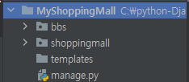

  
  - STATICFILES_DIRS 추가

      - ```python
        STATICFILES_DIRS = [os.path.join(BASE_DIR, 'static')]
        ```

  - static 폴더도 추가

- 기본 테이블 생성
  
  - python manage.py migrate
- admin id/pw 생성
  
- python manage.py createsuperuser
  
- 서버기동 이후 admin 페이지 접속

- bbs application 개발

  - Model 생성 (Table과 1:1)

    ```python
    class Post(models.Model):
        author = models.CharField('작성자', max_length=20)
        contents = models.CharField('글 내용', max_length=100)
    ```

  - admin.py에 추가

    ```python
    from bbs.models import Post
    
    admin.site.register(Post)
    ```

  - migration 초안 작성

    - python manage.py makemigrations

  - 실제 datebase에 적용

    - python manage.py migrate

- url 경로 설정

  - 먼저 Root-URLCONF에서 설정

    ```python
    from django.contrib import admin
    from django.urls import path
    from django.conf.urls import url
    # view함수가 아닌 html을 바로 호출
    from django.views.generic.base import TemplateView
    
    # Url pattern 설정할때 사용할 수 있는 함수
    # url(), path(), re_path()
    # url() : 예전에 사용했던 함수, 정규표현식을 포함해서 일반적인 설정이 가능
    # 사용하기 힘들어 path(), re_path()로 분리 (2.0 이후)
    # path() : 일반 문자역 형태로 url conf할 때
    # re_path() : 정규표현식(regular expression)으로 url conf할떄
    # 정규표현식 = [a-z] : 영문 소문자로 이루어진 1개 ex) s
    # 정규표현식 = [a-z]{3} : 영문 소문자로 이루어진 3개 ex) asd
    # ^(Caret) : 문자열의 시작, $ : 문자열의 끝
    
    urlpatterns = [
        url(r'^$', TemplateView.as_view(template_name='index.html')),
        path('admin/', admin.site.urls),
    ]
    ```
    
    

- templates 폴더에 index.html 작성

  - 부트스트랩에서 예시 가져와서 변형

      ```html

      <!doctype html>
    <html lang="en" class="h-100">
        <head>
          <meta charset="utf-8">
          <title>Welcome My Shopping Mall</title>
      
      
          <!-- Bootstrap core CSS -->
          <link href="https://cdn.jsdelivr.net/npm/bootstrap@5.0.0-beta1/dist/css/bootstrap.min.css" rel="stylesheet" integrity="sha384-giJF6kkoqNQ00vy+HMDP7azOuL0xtbfIcaT9wjKHr8RbDVddVHyTfAAsrekwKmP1" crossorigin="anonymous">
          <script src="https://cdn.jsdelivr.net/npm/bootstrap@5.0.0-beta1/dist/js/bootstrap.bundle.min.js" integrity="sha384-ygbV9kiqUc6oa4msXn9868pTtWMgiQaeYH7/t7LECLbyPA2x65Kgf80OJFdroafW" crossorigin="anonymous"></script>
      
          <style>
            .bd-placeholder-img {
              font-size: 1.125rem;
              text-anchor: middle;
              -webkit-user-select: none;
              -moz-user-select: none;
              user-select: none;
            }
      
            @media (min-width: 768px) {
              .bd-placeholder-img-lg {
                font-size: 3.5rem;
              }
            }
          </style>
      
      
          <!-- Custom styles for this template -->
          <link href="/static/css/cover.css" rel="stylesheet">
        </head>
      
        <body class="d-flex h-100 text-center text-white bg-dark">
      
      <div class="cover-container d-flex w-100 h-100 p-3 mx-auto flex-column">
        <header class="mb-auto">
          <div>
            <h3 class="float-md-start mb-0">Cover</h3>
            <nav class="nav nav-masthead justify-content-center float-md-end">
            </nav>
          </div>
        </header>
      
        <main class="px-3">
          <h1>Welcome to My Shopping Mall</h1>
          <p class="lead">게시판뿐이에요</p>
          <p class="lead">
            <a href="/bbs/list/" class="btn btn-lg btn-secondary fw-bold border-white bg-white">Enter BBS</a>
          </p>
        </main>
      
        <footer class="mt-auto text-white-50">
          <p>Cover template for <a href="https://getbootstrap.com/" class="text-white">Bootstrap</a>, by <a href="https://twitter.com/mdo" class="text-white">@mdo</a>.</p>
        </footer>
      </div>
      
      
        </body>
      </html>
      
    ```
    
  - static(정적 요소) 폴더안에 css 추가
  
  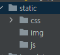
  - 메인 페이지 화면
  
    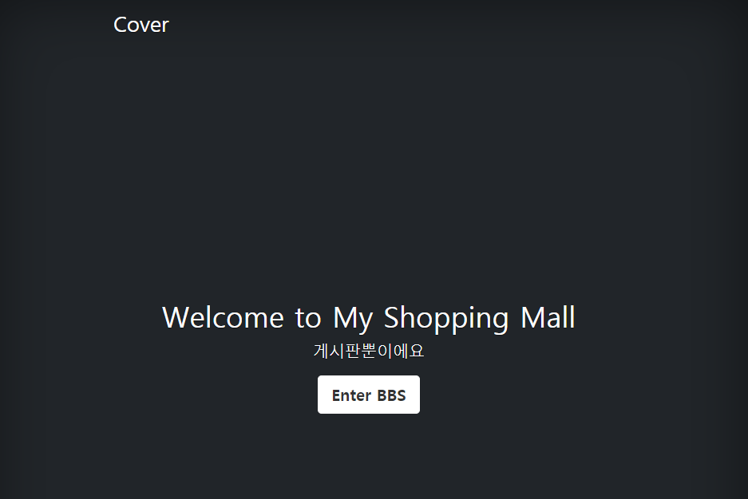


- bbs의 urls.py 생성

  ```python
  from django.urls import path, include
  
  urlpatterns = [
      url(r'^$', TemplateView.as_view(template_name='index.html')),
      path('admin/', admin.site.urls),
      # 이부분 추가
      path('bbs/', include('bbs.urls'))
  ]
  ```


- bbs 폴더 안에 urls.py 추가 후 설정

  ```python
  from django.urls import path
  from bbs import views
  
  app_name = 'bbs'
  
  urlpatterns = [
      path('list/', views.p_list, name='p_list')
  ]
  ```

  

- views.py에 p_list() 작성

  ```python
  from django.shortcuts import render
  from bbs.models import Post
  
  
  # Create your views here.
  def p_list(request):
      # 데이터베이스의 모든 글의 내용을 다 들고와야함
      posts = Post.objects.all().order_by('-id')
      return render(request, 'bbs/list.html', {'posts': posts})
  
  ```

  

- list.html 생성 후 작성

  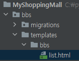

- base.html

  - html에서 공통적으로 사용하는 부분을 하나의 file로 작성하고 가져다 사용하는 방식을 이용

  - BASE_DIR 바로 아래 templates에 base.html 생성

    ```html
    <!DOCTYPE html>
    <html lang="en">
    <head>
        <meta charset="UTF-8">
        <title></title>
        <!-- jQuery CDN -->
        <script src="https://code.jquery.com/jquery-2.2.4.min.js"
                integrity="sha256-BbhdlvQf/xTY9gja0Dq3HiwQF8LaCRTXxZKRutelT44="
                crossorigin="anonymous"></script>
        <!-- Bootstrap CDN -->
        <link href="https://cdn.jsdelivr.net/npm/bootstrap@5.0.0-beta1/dist/css/bootstrap.min.css"
              rel="stylesheet" integrity="sha384-giJF6kkoqNQ00vy+HMDP7azOuL0xtbfIcaT9wjKHr8RbDVddVHyTfAAsrekwKmP1"
              crossorigin="anonymous">
        <script src="https://cdn.jsdelivr.net/npm/bootstrap@5.0.0-beta1/dist/js/bootstrap.bundle.min.js"
                integrity="sha384-ygbV9kiqUc6oa4msXn9868pTtWMgiQaeYH7/t7LECLbyPA2x65Kgf80OJFdroafW"
                crossorigin="anonymous"></script>
    </head>
    <body>
        
        
    </body>
    </html>
    ```

    

- base.html을 이용하여 list.html 작성

  ```html
  
  
  
      <script src="/static/js/posts.js"></script>
      <div class='container'>
          <h1>Bulletin Board System(BBS)</h1>
          <button type="button"
                  class="btn btn-primary"
                  onclick="new_post()">새글작성</button>
          <div class="m-1"></div>
  
          <div class="table-responsive">
          <table class="table table-striped table-sm">
                <thead>
                  <tr>
                    <th>#</th>
                    <th>글 작성자</th>
                    <th>글 내용</th>
                    <th>수정</th>
                    <th>삭제</th>
                  </tr>
                </thead>
                <tbody>
                  <tr>
                    <td>1</td>
                    <td>홍길동</td>
                    <td>소리없는 아우성</td>
                    <td>버튼1</td>
                    <td>버튼2</td>
                  </tr>
                </tbody>
          </table>
      </div>
      </div>
  
  
  
  ```

  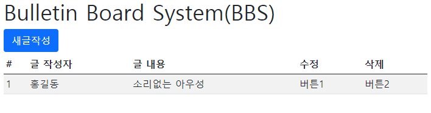

- admin에서 데이터 추가

  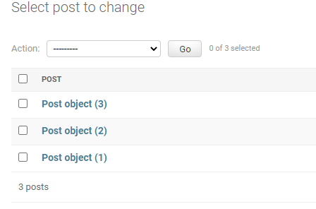

  - `__str__` 처리 안해서 오브젝트로 찍힘

    ```python
    class Post(models.Model):
    
        def __str__(self):
            return self.contents
    ```

    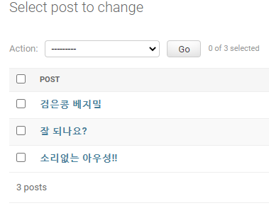

  - 게시글 가져오기

    ```html
    <tbody>
    
      <tr>
          <td>{{ post.id }}</td>
          <td>{{ post.author }}</td>
          <td>{{ post.contents }}</td>
          <td>버튼1</td>
          <td>버튼2</td>
      </tr>
    
    </tbody>
    ```

- model form 

  - pip install django-bootstrap4을 통해 설치

  - settings.py에 추가

    ```python
    INSTALLED_APPS = [
        # 추가
        'bootstrap4'
    ]
    ```

  - forms.py 추가

    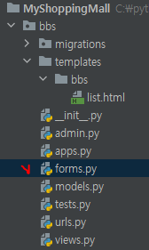

  - forms.py 작성

    ```python
    # 여기서 ModelForm class를 정의
    # ModelForm이 자동으로 Form field(HTML tag)를 생성
    # Form 처리를 상당히 간단하게 처리할 수 있다
    from django import forms
    from bbs.models import Post
    
    
    class PostForm(forms.ModelForm):
        class Meta:
            model = Post
            fields = ['author', 'contents']
    
    ```

- posts.js 만들고 작성

  ```javascript
  function new_post() {
      location.href = 'bbs/create'
  }
  ```

- urls.py 수정

  ```python
  urlpatterns = [
      path('list/', views.p_list, name='p_list'),
      path('create/', views.p_create, name='p_create')
  ]
  ```

- p_create() 추가

  ```python
  def p_create(request):
      # GET 방식
      post_form = PostForm()
      return render(requestm, 'bbs/create.html', {'post_form': post_form})
  ```

- create.html 작성

  ```html
  
  
  
      <div class="container">
          <h1>New POST</h1>
          <form method="post">
              
              
              <button type="submit"
                      class="btn btn-primary">등록</button>
          </form>
      </div>
  
  ```

  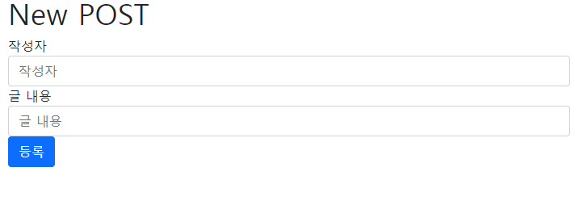

  - 이때 `<form>`에 action을 지정하지 않으면 자기 자신으로 돌아온다. 이 경우 GET방식으로 다시 호출하게 된다. 

- p_create() 수정

  ```python
  def p_create(request):
      # POST 방식
      if request.method == 'POST':
          # 데이터 베이스에 저장
          # 사용자가 데이터는 request.POST에 들어가 있다
          post_form = PostForm(request.POST)
  
          if post_form.is_valid():
              post_form.save()
              # 다른 곳으로 접속하기
              return redirect('bbs:p_list')
  
      # GET 방식
      if request.method == 'GET':
          # 빈 입역 form을 출력하는 코드
          post_form = PostForm()
          return render(request, 'bbs/create.html', {'post_form': post_form})
  ```

  

- 삭제하기 & 수정하기

  - 각 버튼에 자바스크립트 함수를 지정하고 해당 글의 id를 인자로 넣어줌

      ```html
      
      <tr>
          <td>{{ post.id }}</td>
          <td>{{ post.author }}</td>
          <td>{{ post.contents }}</td>
          <td><button type="button" class="btn btn-secondary"
                      onclick="change_contents({{ post.id }})">수정</button></td>
          <td><button type="button" class="btn btn-secondary"
                      onclick="delete_contents({{ post.id }})">삭제</button></td>
      </tr>
      
      ```

  - 자바스크립트 함수 작성 

      ```javascript
      function change_contents(post_id) {
          let temp_url = '/bbs/change/'+post_id
          location.href = temp_url
      }
      
      function delete_contents(post_id) {
          let temp_url = '/bbs/delete/'+post_id
          location.href = temp_url
      }
      ```

  - urls.py에서 자바스크립트에서 언급한 url 추가

    ```python
    urlpatterns = [
        path('delete/<int:post_id>', views.p_delete, name='p_delete'),
        path('change/<int:post_id>', views.p_change, name='p_change')
    ]
    ```

  - p_delete() 작성

    - 참고사항 : [delete()](https://docs.djangoproject.com/en/3.1/ref/models/querysets/#delete)

    ```python
    def p_delete(request, post_id):
        post = get_object_or_404(Post, pk=post_id)
        Post.objects.filter(id=post_id).delete()
        return render(request, 'bbs/delete.html', {'post': post})
    ```

  - delete.html 작성

    ```html
    
    
    <script src='/static/js/posts.js'></script>
    
    <div class="container">
        <h1>Delete POST</h1>
        <div class="table-responsive">
            <h3>아래의 글이 지워졌습니다</h3>>
            <table class="table table-striped table-sm">
                <thead>
                    <tr>
                        <th>#</th>
                        <th>글 작성자</th>
                        <th>글 내용</th>
                    </tr>
                </thead>
                <tbody>
                    <tr>
                        <td>{{ post.id }}</td>
                        <td>{{ post.author }}</td>
                        <td>{{ post.contents }}</td>
                    </tr>
                </tbody>
            </table><br>
            <button type="button" class="btn btn-primary"
                    onclick="return_list()">돌아가기</button>
        </div>
    </div>
    
    ```

  - retrun_list() 작성

    ```javascript
    function return_list() {
        location.href = '/bbs/list'
    }
    ```

  - p_change() 작성

    - 사실 온전한 수정기능이라 보기 어렵다.  정확히 말하면 기존의 글을 지우고 사용자가 입력한 값으로 새로운 글을 만드는 기능
    - [update()](https://docs.djangoproject.com/en/3.1/ref/models/querysets/#update)를 이용하려고 했는데 뭔가 원하는 기능이 아닌거 같아서 포기

    ```python
    def p_change(request, post_id):
        if request.method == 'POST':
            post_form = PostForm(request.POST)
    
            if post_form.is_valid():
                Post.objects.filter(id=post_id).delete()
                post_form.save()
                return redirect('bbs:p_list')
    
        if request.method == 'GET':
            post_form = PostForm()
            post = get_object_or_404(Post, pk=post_id)
            return render(request, 'bbs/change.html', {'post': post, 'post_form': post_form})
    ```

  - create.html 작성

    ```html
    
    
    
        <div class="container">
            <h1>Change POST</h1>
             <div class="table-responsive">
                 <h3>수정하기</h3>>
             <table class="table table-striped table-sm">
                  <thead>
                    <tr>
                      <th>#</th>
                      <th>글 작성자</th>
                      <th>글 내용</th>
                    </tr>
                  </thead>
                  <tbody>
                    <tr>
                        <td>{{ post.id }}</td>
                        <td>{{ post.author }}</td>
                        <td>{{ post.contents }}</td>
                    </tr>
                  </tbody>
             </table><br>
             <form method="post">
                
                
                <button type="submit"
                        class="btn btn-primary">수정</button>
            </form>
        </div>
        </div>
    
    ```

    

- 결과

  - 삭제

    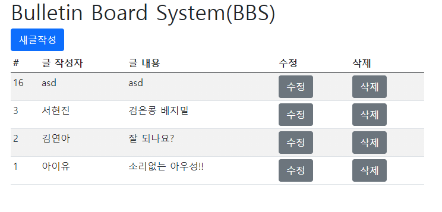

    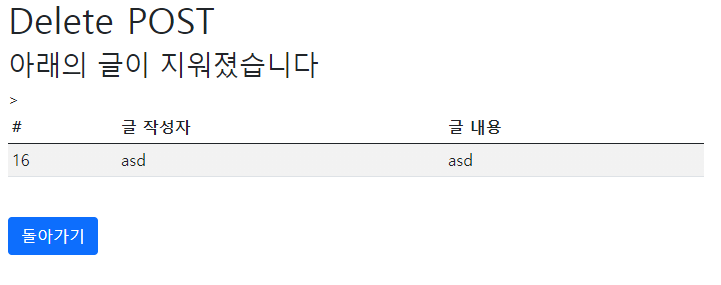

    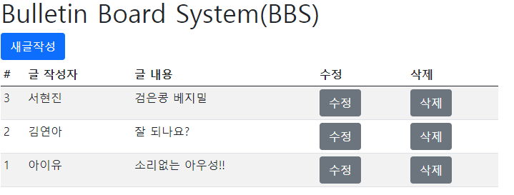

    

  - 수정

    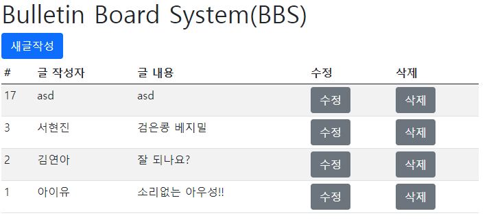

    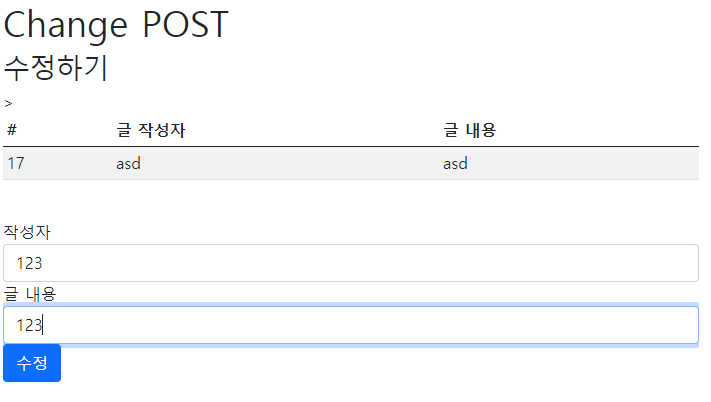

    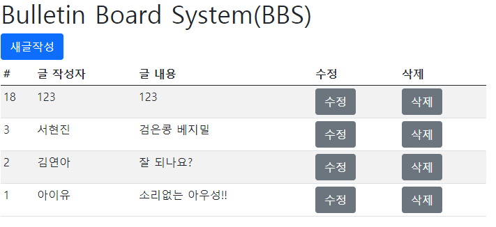

- 비고

  - 다른 방법으로 수정하기

  - 사실 이 방법이 정확한 수정하는 방법인거 같음

    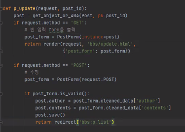

    - `instance=`, `cleaned_data['']`를 알아야 함

